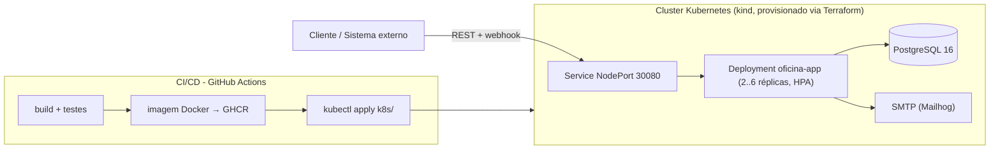

# Sistema de Oficina Mecânica - Tech Challenge

Sistema integrado de gestão de oficina mecânica desenvolvido como MVP para o Tech Challenge. O sistema permite gerenciar ordens de serviço, clientes, veículos, serviços e peças com controle de estoque e acompanhamento em tempo real.

## 📹 Demonstração Completa

**Video de demonstração com todos os endpoints funcionando (Fase 1):** https://www.awesomescreenshot.com/video/52274462?key=d86c873188c071d0944347547ee234dd

**Vídeo demonstrativo da Fase 2 (deploy, CI/CD, APIs, HPA):** https://www.awesomescreenshot.com/video/54542994?key=99327f9bbfe766f7c14307bca56dcd4b

## Fase 2 — Objetivos

Evolução da aplicação da Fase 1 para garantir **qualidade, resiliência e escalabilidade**:

- Refatoração para **arquitetura hexagonal** (ports & adapters) — a aplicação depende de interfaces de domínio (`domain/repositories`), implementadas por adapters JPA e SMTP na infraestrutura;
- Novas APIs de Ordem de Serviço: consulta de status, webhook de aprovação/recusa de orçamento, listagem ordenada por prioridade com exclusão lógica;
- Notificação do cliente por **e-mail** a cada mudança de status da OS;
- **Kubernetes** ([`k8s/`](k8s/)): Deployments, Services, ConfigMap, Secrets e HPA (escala de 2 a 6 pods por CPU/memória);
- **Terraform** ([`infra/`](infra/)): provisionamento do cluster (kind) e do banco de dados;
- **CI/CD** (GitHub Actions): build, testes, imagem Docker no GHCR e deploy dos manifestos em cluster Kubernetes.

### Desenho da Arquitetura



**Fluxo de deploy:** push na branch → `build-and-test` (Maven + JaCoCo) → `docker` (build e push da imagem para `ghcr.io/daniloichaves/oficina-mecanica`) → `deploy` (cluster kind no runner, `kubectl apply -f k8s/`, rollout do banco e da aplicação, smoke test no `/actuator/health`).

### Decisões de arquitetura (Fase 2)

- **Hexagonal pragmática:** os ports de repositório/notificação vivem em `domain/repositories`; os adapters (Spring Data JPA, SMTP) na infraestrutura. As entidades de domínio mantêm anotações JPA — tradeoff consciente de MVP para não duplicar o modelo; documentado nos próprios ports.
- **Recusa de orçamento → status `CANCELADA`:** o enunciado prevê aprovação/recusa via notificação externa; a recusa encerra a OS com `CANCELADA` (fora da fila de trabalho, mantida no banco).
- **Exclusão lógica na listagem:** `GET /api/ordens-servico` omite `FINALIZADA`/`ENTREGUE`/`CANCELADA` (nada é apagado; tudo permanece acessível por id e em `/paginado`).

## Stack Tecnológica

- **Java 21** - Linguagem principal
- **Spring Boot 3.2.5** - Framework
- **Spring Data JPA** - ORM e persistência
- **PostgreSQL 16** - Banco de dados relacional
- **Spring Security + JWT** - Autenticação stateless
- **SpringDoc OpenAPI** - Documentação da API (Swagger)
- **Lombok** - Redução de código boilerplate
- **Maven** - Gerenciamento de dependências
- **Docker** - Containerização

## Arquitetura

O projeto segue **DDD** com **arquitetura hexagonal (ports & adapters)**:

```
src/main/java/com/oficina/mecanica/
├── domain/                 # Núcleo (não depende da infraestrutura)
│   ├── entities/          # Entidades (Cliente, Veículo, OS, etc.)
│   ├── valueobjects/      # Value Objects (CPF/CNPJ, Placa)
│   └── repositories/      # PORTS: interfaces de repositório e notificação
├── application/           # Camada de Aplicação
│   ├── dto/              # Data Transfer Objects
│   └── services/         # Casos de uso (dependem só dos ports)
├── infrastructure/       # ADAPTERS
│   ├── persistence/      # Spring Data JPA implementando os ports
│   ├── notification/     # Adapter SMTP (e-mail de mudança de status)
│   ├── security/         # JWT / Spring Security
│   └── config/           # Configurações gerais
└── presentation/          # Adapter de entrada
    └── rest/             # Controllers REST
```

## Documentação DDD

A modelagem completa do domínio (Event Storming, Bounded Contexts, Linguagem Ubíqua, Diagrama de Estados e Hotspots) está disponível em dois formatos:

- **Miro (visual)**: https://miro.com/app/board/uXjVHZcarWY=/
- **Markdown (versionado)**: pasta [`docs/ddd/`](docs/ddd/)
  - `01-linguagem-ubiqua.md` — Glossário oficial do domínio
  - `02-event-storming-os.md` — Fluxo da Ordem de Serviço
  - `03-event-storming-pecas.md` — Fluxo de Estoque
  - `04-bounded-contexts.md` — Context Map estratégico
  - `05-design-level.md` — Aggregates, Entidades, Value Objects
  - `06-casos-de-uso.md` — Casos de uso mapeados

## Funcionalidades

### Gestão de Clientes
- CRUD completo de clientes
- Validação de CPF/CNPJ
- Busca por CPF/CNPJ

### Gestão de Veículos
- CRUD completo de veículos
- Validação de placa (formato antigo e Mercosul)
- Associação com clientes
- Busca por placa

### Gestão de Serviços
- CRUD completo de serviços
- Definição de valor e tempo estimado

### Gestão de Peças e Insumos
- CRUD completo de peças
- Controle de estoque
- Alerta de estoque baixo
- Atualização de estoque

### Ordens de Serviço
- Criação de OS com serviços e peças
- Fluxo de status automático:
  - Recebida → Em Diagnóstico → Aguardando Aprovação → Em Execução → Finalizada → Entregue
- Cálculo automático de orçamento
- Aprovação de orçamento
- Controle de estoque ao criar OS
- Consulta por cliente, veículo ou status

### Métricas
- Tempo médio de execução dos serviços

## Execução Local

### Pré-requisitos
- Java 21 ou superior
- Maven 3.6+
- PostgreSQL 16+ (ou usar Docker)

### Passo 1: Configurar Banco de Dados

**Opção A: Usar Docker (Recomendado)**
```bash
docker run -d \
  --name oficina-postgres \
  -e POSTGRES_DB=oficina_mecanica \
  -e POSTGRES_USER=oficina \
  -e POSTGRES_PASSWORD=oficina123 \
  -p 5432:5432 \
  postgres:16-alpine
```

**Opção B: PostgreSQL Local**
```sql
CREATE DATABASE oficina_mecanica;
CREATE USER oficina WITH PASSWORD 'oficina123';
GRANT ALL PRIVILEGES ON DATABASE oficina_mecanica TO oficina;
```

### Passo 2: Executar a Aplicação

```bash
cd oficina-mecanica
mvn spring-boot:run
```

A aplicação estará disponível em `http://localhost:8080`

### Documentação da API

Acesse o Swagger UI em: `http://localhost:8080/swagger-ui.html`

## Execução com Docker

### Usando docker-compose (Recomendado)

```bash
cd oficina-mecanica
docker-compose up -d
```

Ou via WSL no Windows:
```bash
wsl docker compose up -d
```

Isso iniciará:
- PostgreSQL na porta 5432
- Mailhog (SMTP dev) nas portas 1025/8025 — UI em http://localhost:8025
- Aplicação Spring Boot na porta 8080

### Verificar logs

```bash
docker-compose logs -f app
```

### Parar containers

```bash
docker-compose down
```

## Deploy em Kubernetes (Fase 2)

Pré-requisitos: cluster Kubernetes (kind, minikube ou cloud) e `kubectl` configurado.

```bash
kubectl apply -f k8s/
kubectl -n oficina rollout status deployment/oficina-app
```

Sobe: namespace `oficina`, PostgreSQL (PVC + Deployment + Service), Mailhog, aplicação (2 réplicas, probes no `/actuator/health`), Service NodePort `30080` e HPA (2–6 réplicas, CPU 70% / memória 80%).

O HPA exige o **metrics-server** (instruções em [`infra/README.md`](infra/README.md)). Para testar a escalabilidade: gerar carga nas APIs e acompanhar com `kubectl -n oficina get hpa -w`.

## Provisionamento com Terraform (Fase 2)

Cluster kind + banco de dados provisionados via IaC — recursos, pré-requisitos e passo a passo documentados em [`infra/README.md`](infra/README.md):

```bash
cd infra && terraform init && terraform apply
```

## CI/CD (Fase 2)

Pipeline em [`.github/workflows/ci.yml`](.github/workflows/ci.yml) com 3 estágios:

1. **build-and-test** — `mvn clean verify` (testes + gate de cobertura JaCoCo);
2. **docker** — build e push da imagem para `ghcr.io/daniloichaves/oficina-mecanica` (`latest` + SHA);
3. **deploy** — cria cluster kind no runner, carrega a imagem, aplica `k8s/` (banco + app), aguarda os rollouts e roda smoke test no `/actuator/health`.

## Collection das APIs

- **Swagger UI:** http://localhost:8080/swagger-ui.html (OpenAPI em `/api-docs`)
- **Postman:** [`docs/postman/oficina-mecanica.postman_collection.json`](docs/postman/oficina-mecanica.postman_collection.json)

## Endpoints da API

### Clientes
- `POST /api/clientes` - Criar cliente
- `GET /api/clientes` - Listar todos
- `GET /api/clientes/paginado` - Listar com paginação (padrão: page=0, size=10)
- `GET /api/clientes/{id}` - Buscar por ID
- `GET /api/clientes/cpf/{cpfCnpj}` - Buscar por CPF/CNPJ
- `PUT /api/clientes/{id}` - Atualizar
- `DELETE /api/clientes/{id}` - Deletar

### Veículos
- `POST /api/veiculos` - Criar veículo
- `GET /api/veiculos` - Listar todos
- `GET /api/veiculos/paginado` - Listar com paginação (padrão: page=0, size=10)
- `GET /api/veiculos/{id}` - Buscar por ID
- `GET /api/veiculos/placa/{placa}` - Buscar por placa
- `GET /api/veiculos/cliente/{clienteId}` - Listar por cliente
- `PUT /api/veiculos/{id}` - Atualizar
- `DELETE /api/veiculos/{id}` - Deletar

### Serviços
- `POST /api/servicos` - Criar serviço
- `GET /api/servicos` - Listar todos
- `GET /api/servicos/paginado` - Listar com paginação (padrão: page=0, size=10)
- `GET /api/servicos/{id}` - Buscar por ID
- `PUT /api/servicos/{id}` - Atualizar
- `DELETE /api/servicos/{id}` - Deletar

### Peças
- `POST /api/pecas` - Criar peça
- `GET /api/pecas` - Listar todas
- `GET /api/pecas/paginado` - Listar com paginação (padrão: page=0, size=10)
- `GET /api/pecas/{id}` - Buscar por ID
- `GET /api/pecas/estoque-baixo` - Listar estoque baixo
- `PUT /api/pecas/{id}` - Atualizar
- `PATCH /api/pecas/{id}/estoque` - Atualizar estoque
- `DELETE /api/pecas/{id}` - Deletar

### Ordens de Serviço
- `POST /api/ordens-servico` - Criar OS
- `GET /api/ordens-servico` - Listar OS ativas
- `GET /api/ordens-servico/paginado` - Listar com paginação
- `GET /api/ordens-servico/{id}` - Buscar por ID
- `GET /api/ordens-servico/{id}/status` - Consultar status
- `GET /api/ordens-servico/cliente/{clienteId}` - Listar por cliente
- `GET /api/ordens-servico/veiculo/{veiculoId}` - Listar por veículo
- `GET /api/ordens-servico/status/{status}` - Listar por status
- `PATCH /api/ordens-servico/{id}/iniciar-diagnostico` - Iniciar diagnóstico
- `PATCH /api/ordens-servico/{id}/concluir-diagnostico` - Concluir diagnóstico
- `PATCH /api/ordens-servico/{id}/aprovar-orcamento` - Aprovar orçamento
- `PATCH /api/ordens-servico/{id}/finalizar` - Finalizar OS
- `PATCH /api/ordens-servico/{id}/entregar` - Entregar veículo

### Webhooks
- `POST /api/webhooks/orcamento` - Receber aprovação/recusa externa
### Webhooks (Fase 2)
- `POST /api/webhooks/orcamento` - Notificação externa de aprovação/recusa do orçamento (público, sem JWT)
  ```json
  { "ordemServicoId": 1, "aprovado": true }
  ```

> **Notificação por e-mail (Fase 2):** a cada mudança de status da OS o cliente recebe um e-mail. Em desenvolvimento, os e-mails ficam visíveis no Mailhog: http://localhost:8025

### Métricas
- `GET /api/metricas/tempo-medio-execucao` - Tempo médio de execução

## Exemplo de Uso

### 1. Criar um Cliente
```bash
curl -X POST http://localhost:8080/api/clientes \
  -H "Content-Type: application/json" \
  -d '{
    "cpfCnpj": "52998224725",
    "nome": "João Silva",
    "telefone": "11999999999",
    "email": "joao@email.com",
    "endereco": "Rua das Flores, 150, São Paulo - SP"
  }'
```

> **Nota:** O CPF/CNPJ é validado algoritmicamente. Use um CPF válido (ex: `52998224725`, `98765432100`).

### 2. Criar um Veículo
```bash
curl -X POST http://localhost:8080/api/veiculos \
  -H "Content-Type: application/json" \
  -d '{
    "placa": "ABC1234",
    "marca": "Toyota",
    "modelo": "Corolla",
    "ano": 2020,
    "clienteId": 1
  }'
```

### 3. Criar uma Ordem de Serviço
```bash
curl -X POST http://localhost:8080/api/ordens-servico \
  -H "Content-Type: application/json" \
  -d '{
    "clienteId": 1,
    "veiculoId": 1,
    "itensServico": [
      {
        "servicoId": 1,
        "quantidade": 1
      }
    ]
  }'
```

## Variáveis de Ambiente

| Variável | Descrição | Padrão |
|----------|-----------|--------|
| DB_URL | URL do banco de dados | jdbc:postgresql://localhost:5432/oficina_mecanica |
| DB_USERNAME | Usuário do banco | oficina |
| DB_PASSWORD | Senha do banco | oficina123 |
| JWT_SECRET | Secret para JWT | oficinaMecanicaSecretKey... |
| JWT_EXPIRATION | Expiração do token (ms) | 86400000 |
| MAIL_HOST | Host SMTP para notificações | localhost |
| MAIL_PORT | Porta SMTP | 1025 |

## Pipeline de Segurança e Qualidade

O projeto inclui um pipeline automatizado de análise de segurança e qualidade via script:

```bash
./oficina-mecanica-tech.sh security
```

Este comando executa sequencialmente:

| Etapa | Ferramenta | O que verifica |
|-------|-----------|---------------|
| 1 | **Trivy** | Vulnerabilidades no Dockerfile, docker-compose e código |
| 2 | **JaCoCo** | Cobertura de testes (mínimo 90% em domínios críticos) |
| 3 | **SonarQube** | Qualidade de código, duplicação e code smells |
| 4 | **Consolidação** | Gera `target/security/security-summary.md` com evidências |

### Outros comandos disponíveis

```bash
./oficina-mecanica-tech.sh trivy     # Apenas scan de segurança
./oficina-mecanica-tech.sh sonar     # Apenas análise SonarQube
./oficina-mecanica-tech.sh coverage  # Apenas cobertura JaCoCo
./oficina-mecanica-tech.sh help      # Lista todos os comandos
```

### Relatório de Vulnerabilidades

O relatório gerencial de segurança está disponível em:
- `docs/RELATORIO-SEGURANCA-GERENCIAL.md`

Inclui:
- Vulnerabilidades HIGH/CRITICAL encontradas
- Plano de ação com prioridades
- Evidências das ferramentas (Trivy, JaCoCo, SonarQube)

## Testes

```bash
mvn test
```

Para verificar cobertura de testes:
```bash
mvn clean test jacoco:report
```

O relatório será gerado em `target/site/jacoco/index.html`

## Estrutura do Projeto

```
oficina-mecanica/
├── src/
│   ├── main/
│   │   ├── java/
│   │   └── resources/
│   │       └── application.yml
│   └── test/
│       └── java/
├── Dockerfile
├── docker-compose.yml
├── pom.xml
└── README.md
```

## Contribuição

Este projeto foi desenvolvido como parte do Tech Challenge da fase.

## Colaboradores

Danilo Ischiavolini Chaves
Rodrigo Dias Bragantini 
William de Oliveira Almeida

## Licença

Projeto acadêmico - Tech Challenge

