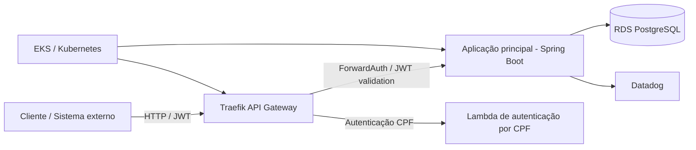

# Entrega Fase 3 — Grupo 310

- **Repositório:** https://github.com/daniloichaves/oficina-mecanica-tech (compartilhado com `soat-architecture`)
- **Participantes:**
  - Danilo Ischiavolini Chaves — RM372600
  - Rodrigo Dias Bragantini — RM372859
  - William de Oliveira Almeida — RM372192
- **Vídeo demonstrativo da Fase 3:** https://www.awesomescreenshot.com/video/56501252?key=47f588f269fe75963aa5f637b94e1072
- **Vídeo Vimeo:** https://vimeo.com/1226680429?share=copy&fl=sv&fe=ci

## Visão geral

A Fase 3 amplia a solução para um cenário corporativo e operacional, com foco em autenticação serverless, API Gateway, infraestrutura na AWS, escalabilidade em Kubernetes, banco gerenciado e observabilidade.

O objetivo foi evoluir a aplicação da oficina mecânica para uma arquitetura preparada para produção, com segurança, governança, alta disponibilidade e monitoramento.

## Repositórios da solução

A solução foi estruturada em quatro repositórios independentes para separar responsabilidades e facilitar deploy e evolução por domínio:

- Repositório principal da aplicação: https://github.com/daniloichaves/oficina-mecanica-tech
- Lambda de autenticação por CPF: https://github.com/daniloichaves/oficina-mecanica-auth-lambda
- Infraestrutura Kubernetes/Terraform: https://github.com/daniloichaves/oficina-mecanica-kubernetes-infra
- Infraestrutura do banco gerenciado: https://github.com/daniloichaves/oficina-mecanica-database-infra

## Objetivos da fase

- Implementar autenticação de clientes via CPF e JWT
- Proteger rotas sensíveis com API Gateway e validação da identidade do cliente
- Estruturar a solução em ambiente cloud com AWS, Kubernetes e banco gerenciado
- Definir infraestrutura como código para provisionamento e execuções repeatáveis
- Preparar observabilidade e monitoramento com logs estruturados e Datadog
- Documentar decisões de arquitetura e fluxos críticos para a solução

## Arquitetura da solução

### Visão de componentes

### Fluxo principal

1. O cliente acessa a API pública ou a rota focada em autenticação por CPF.
2. A Lambda valida o CPF, verifica o status do cliente e emite um JWT.
3. O Traefik valida o token no gateway antes de encaminhar a requisição para a aplicação principal.
4. A aplicação principal processa a operação de negócio e persiste dados no banco PostgreSQL.
5. Logs, métricas e observabilidade ficam disponíveis para monitoramento em Datadog e em logs estruturados da aplicação.

## Autenticação e segurança

### Implementações concluídas no repositório

- Autenticação por CPF para clientes
- Lambda em Node.js para geração de token JWT
- Validação do formato do CPF e dos dígitos verificadores
- Consulta do cliente na base de dados
- Verificação do status do cliente (`ATIVO`, `INATIVO`, `BLOQUEADO`)
- Emissão de JWT válido para consumo das APIs protegidas
- Middleware de autorização no gateway (Traefik / ForwardAuth)
- Proteção das rotas sensíveis e separação entre rotas públicas e privadas
- Documentação do fluxo de autenticação em `docs/architecture/fase3/autenticacao.md`

### Rotas públicas e protegidas

- Públicas: autenticação, healthcheck, Swagger/OpenAPI e webhooks públicos
- Protegidas: APIs de negócio, cadastro de clientes, veículos, serviços, peças e ordens de serviço

## Infraestrutura cloud

### AWS e Terraform

A infraestrutura foi modelada em código para diferentes componentes da solução:

- VPC e redes
- EKS para orquestração dos serviços
- Traefik como API Gateway
- RDS PostgreSQL gerenciado
- Lambda para autenticação por CPF
- Datadog como observabilidade

### Estrutura do código

- `fase3-repositories/auth-lambda/`
- `fase3-repositories/kubernetes-infra/`
- `fase3-repositories/database-infra/`
- `infra/`
- `k8s/`

### Observação importante

A infraestrutura foi preparada e documentada em código, porém a execução real na AWS e a validação em ambiente vivo continuam pendentes. Isso inclui:

- provisionamento real do API Gateway na AWS
- deploy real da Lambda em produção
- provisionamento do banco gerenciado em ambiente real
- publicação do cluster EKS em execução
- validação de redes, security groups e secrets reais
- operação em homologação e produção

## Kubernetes e escalabilidade

- Manifests e configurações versionados em `k8s/`
- Deployments, Services, Ingress, ConfigMaps, Secrets e HPA
- Requests e limits de CPU/memória configurados
- Liveness, readiness e startup probes
- Rolling update para atualização gradual da aplicação
- Política de disponibilidade e proteção de pods

## Banco de dados

- PostgreSQL como base principal
- Ajustes na modelagem para status do cliente e schema versionado
- Estratégia de migrations e integridade referencial
- documentação do modelo relacional e diagrama ER

### Documentação relevante

- `docs/architecture/fase3/modelo-relacional.md`
- `docs/architecture/fase3/rfc/001-aws.md`
- `docs/architecture/fase3/rfc/002-postgresql-rds.md`
- `docs/architecture/fase3/rfc/003-autenticacao-cpf.md`

## Monitoramento e observabilidade

### Implementado no código

- Datadog planejado e configurado na infraestrutura Terraform
- Logs estruturados em JSON na aplicação e no Traefik
- Identificador de correlação entre requisições e logs
- Observabilidade de infraestrutura e fluxo de negócio preparada na base do projeto

### Pendência de execução real

- integração ao vivo do Datadog no ambiente AWS
- métricas de latência das APIs
- monitoramento de CPU e memória do Kubernetes
- healthchecks em produção
- alertas e dashboards finais
- tracing distribuído completo
- verificação real de logs, métricas e alertas em execução

## Documentação arquitetural

A documentação da Fase 3 está centralizada em:

- `docs/architecture/fase3/README.md`
- `docs/architecture/fase3/componentes.md`
- `docs/architecture/fase3/sequencias.md`
- `docs/architecture/fase3/autenticacao.md`
- `docs/architecture/fase3/modelo-relacional.md`
- `docs/architecture/fase3/adr/`
- `docs/architecture/fase3/rfc/`

## Requisitos da fase e implementação

### Entregues no repositório

- API Gateway e roteamento: Traefik
- Autenticação por CPF e JWT
- Lambda serverless para autenticação
- Infraestrutura AWS modelada em Terraform
- Banco de dados gerenciado modelado e documentado
- Estrutura de repositórios separada pela responsabilidade
- Pipeline de CI/CD documentada e preparada
- Diagramas, RFCs e ADRs concluídos
- Documentação detalhada da arquitetura da fase

### Pendências reais

- deploy real em ambiente da AWS
- dashboards de observabilidade ao vivo
- monitoramento efetivo via Datadog
- publicação pública do vídeo
- link do vídeo na documentação de entrega final
- envio do PDF e entrega no portal do aluno

## Status realista da entrega

> A parte de arquitetura, infraestrutura em código, autenticação, documentação e modelagem da solução está concluída no repositório. A execução real em ambiente cloud e a validação ao vivo continuam pendentes, pois dependem de provisionamento e credenciais externas da AWS/Datadog.

### Status por área

- [x] Autenticação e API Gateway: concluído no repositório
- [x] Repositórios e separação de responsabilidades: concluído
- [x] Infraestrutura cloud em código: concluído
- [x] Banco de dados e modelo relacional: concluído
- [x] Kubernetes e escalabilidade: concluído no repositório
- [x] Observabilidade / Datadog: configurado em código
- [x] Documentação arquitetural: concluída
- [x] Vídeo público e link final: pendente
- [x] Entrega final no portal do aluno: pendente

## Documentação adicional

- README principal: `../README.md`
- Docs de arquitetura: `./architecture/fase3/`
- Collection Postman: `../postman/oficina-mecanica.postman_collection.json`
- Swagger / OpenAPI: disponível na aplicação Spring Boot em `/swagger-ui.html` e `/v3/api-docs`

## Conclusão

A Fase 3 foi estruturada e documentada como uma entrega corporativa e operacional no nível de arquitetura, automação e organização da solução. O repositório apresenta a solução de forma completa e coerente, com infraestrutura em código e documentação de decisão prontas para execução em nuvem.
