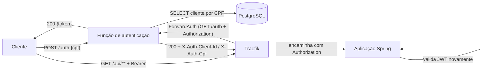
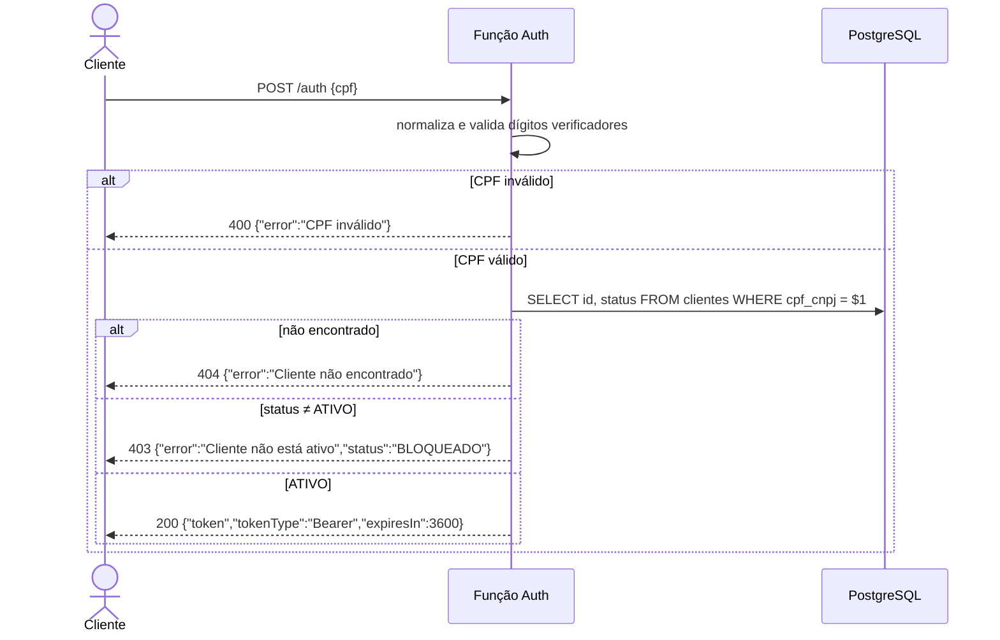
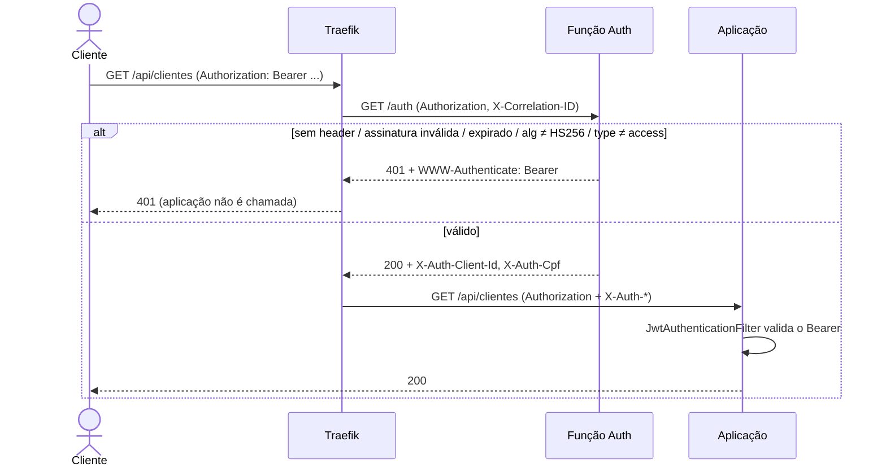

# Autenticação por CPF e validação de JWT no API Gateway

Este documento descreve como o Traefik protege as rotas de negócio da aplicação, como a
função serverless emite e valida os tokens, e quais são os fluxos de sucesso e falha com
seus testes automatizados.

## Visão geral



Há duas camadas de validação, de propósito:

1. **Gateway (Traefik, middleware `lambda-auth@file`)** — toda requisição a `/api/**` passa
   pelo `forwardAuth`. O Traefik chama a função de autenticação repassando `Authorization`
   e `X-Correlation-ID`; se ela responder 2xx, a requisição segue para a aplicação com os
   headers `X-Auth-Client-Id` e `X-Auth-Cpf`; caso contrário, o Traefik devolve ao cliente
   o status da função (401) sem tocar na aplicação.
2. **Aplicação (Spring Security, `JwtAuthenticationFilter`)** — valida o mesmo Bearer com
   o mesmo segredo HS256. Isso mantém a aplicação segura mesmo se for exposta sem o gateway
   (port-forward, execução local) e evita confiar apenas em headers injetados.

O segredo JWT é compartilhado: em AWS ambos leem `oficina-<env>/jwt` do Secrets Manager;
localmente ambos leem `JWT_SECRET` do Secret `oficina-app-secret` (kind) ou do
`docker-compose.yml`.

### Rotas

| Rota | Ingress | Middleware | Autenticação |
|------|---------|------------|--------------|
| `POST /auth` (local) / Function URL (AWS) | público | — | login por CPF |
| `GET /actuator/health`, `/swagger-ui*`, `/api-docs` | `oficina-api-public` | — | nenhuma |
| `POST /api/webhooks/orcamento` | `oficina-api-public` | — | nenhuma (chamado por sistema externo) |
| `/api/**` (clientes, veículos, serviços, peças, OS, métricas) | `oficina-api-protected` | `lambda-auth@file` | Bearer JWT obrigatório |

`/api/webhooks` é uma regra mais específica que `/api`; o Traefik atribui prioridade pelo
tamanho da regra, então o webhook permanece público mesmo com `/api` protegido.

### Onde cada parte está configurada

| Ambiente | Middleware | Ingress | Função |
|----------|-----------|---------|--------|
| Local / CI (kind) | `k8s/traefik-dynamic.yaml` (ConfigMap montado no Traefik, file provider) | `k8s/app-ingress.yaml` | `k8s/auth-lambda.yaml` (imagem `Dockerfile.local`, adapter `src/server.js`) |
| AWS | `helm_release.traefik` em `oficina-mecanica-kubernetes-infra/main.tf` (`providers.file.content`) | `k8s/cloud/public-ingress.yaml`, `k8s/cloud/protected-ingress.yaml` | Lambda + Function URL (`oficina-mecanica-auth-lambda/terraform`) |

## Token

JWT HS256 emitido pela função com as claims:

```json
{ "sub": "52998224725", "clientId": 42, "type": "access", "iat": 1700000000, "exp": 1700003600 }
```

Expiração padrão de 3600 s (`JWT_EXPIRATION_SECONDS` / `jwt_expiration_seconds`). A
validação exige `alg = HS256`, assinatura íntegra, `exp` no futuro e `type = access`.

## Fluxos

### Login por CPF — `POST /auth` com `{ "cpf": "..." }`



| Cenário | Status | Corpo |
|---------|--------|-------|
| Cliente `ATIVO` | 200 | `{ "token", "tokenType": "Bearer", "expiresIn": 3600 }` |
| CPF com dígitos inválidos ou repetidos | 400 | `{ "error": "CPF inválido" }` |
| JSON malformado | 400 | `{ "error": "Corpo da requisição inválido" }` |
| CPF válido sem cadastro | 404 | `{ "error": "Cliente não encontrado" }` |
| Cliente `INATIVO` ou `BLOQUEADO` | 403 | `{ "error": "Cliente não está ativo", "status": "..." }` |
| Falha de banco/segredos | 500 | `{ "error": "Falha interna na autenticação" }` (detalhe só no log) |

Toda resposta carrega `x-correlation-id` (o recebido ou um novo UUID).

### Acesso a rota protegida — `GET /api/clientes`



| Cenário | Status no gateway |
|---------|-------------------|
| Bearer válido | 200 (resposta da aplicação) |
| Sem `Authorization` | 401 `{"error":"Token ausente"}` |
| Token malformado (≠ 3 partes) | 401 `{"error":"Token inválido"}` |
| Assinatura adulterada ou outro segredo | 401 `{"error":"Assinatura inválida"}` |
| Expirado | 401 `{"error":"Token expirado"}` |
| `alg` diferente de HS256 (ex.: `none`) | 401 `{"error":"Algoritmo não suportado"}` |
| Sem claim `type=access` | 401 `{"error":"Token inválido"}` |

## Testes

| Nível | Onde | Cobre |
|-------|------|-------|
| Unitário (função) | `fase3-repositories/auth-lambda/test/auth.test.js` | validação de CPF; login 200/400/403/404/500; ForwardAuth 200/401 (ausente, expirado, adulterado, outro segredo, `alg=none`, sem `type`, malformado); propagação de `X-Correlation-ID` |
| Adapter HTTP | `fase3-repositories/auth-lambda/test/server.test.js` | `/health`, `POST /auth` → token, `GET /auth` com e sem Bearer |
| Aplicação | `src/test/.../SecurityIntegrationTest.java`, `JwtAuthenticationFilterTest.java`, `JwtServiceTest.java` | segunda camada (Spring Security) |
| Ponta a ponta (gateway) | job `deploy` em `.github/workflows/ci.yml`, step *Authentication flow test* | via Traefik em kind: 401 sem token, 401 adulterado, 400/404/403 no login, 200 no login, 200 com token, webhook público |

Executar localmente:

```bash
cd fase3-repositories/auth-lambda && npm ci && npm test
```

## Teste manual

Local com docker-compose (`docker compose up -d`): função em `http://localhost:8081`,
aplicação em `http://localhost:8080` (sem gateway — vale a validação do Spring).
Com kind (`kubectl apply -f k8s/`): tudo via Traefik em `http://localhost:30080`.

```bash
GW=http://localhost:30080

# cliente de teste (CPF válido) — só necessário em banco vazio
kubectl -n oficina exec deploy/postgres -- psql -U oficina -d oficina_mecanica -c \
  "INSERT INTO clientes (cpf_cnpj,nome,telefone,email,status,data_cadastro)
   VALUES ('52998224725','Cliente Teste','11999999999','t@x.com','ATIVO',NOW()) ON CONFLICT DO NOTHING;"

curl -i $GW/api/clientes                                   # 401 — bloqueado no gateway
curl -i -X POST $GW/auth -H 'Content-Type: application/json' -d '{"cpf":"11111111111"}'  # 400
curl -i -X POST $GW/auth -H 'Content-Type: application/json' -d '{"cpf":"12345678909"}'  # 404
TOKEN=$(curl -s -X POST $GW/auth -H 'Content-Type: application/json' -d '{"cpf":"52998224725"}' | jq -r .token)
curl -i -H "Authorization: Bearer $TOKEN" $GW/api/clientes  # 200
```

Na AWS, troque `$GW/auth` pela Function URL da Lambda (`terraform output function_url`
em `oficina-mecanica-auth-lambda`) e `$GW` pelo host do Ingress.

## Configuração da função

| Variável | AWS | Local |
|----------|-----|-------|
| Segredos | `DB_SECRET_ARN`, `JWT_SECRET_ARN` (Secrets Manager) | `JWT_SECRET`, `DB_HOST`, `DB_PORT`, `DB_NAME`, `DB_USER`, `DB_PASSWORD` |
| TLS do banco | padrão (`rejectUnauthorized: true`); `DB_SSL_CA_PATH` para o bundle de CA do RDS | `DB_SSL=false` |
| Expiração | `JWT_EXPIRATION_SECONDS` | idem |

A presença de `JWT_SECRET` no ambiente seleciona o modo local; sem ela a função usa o
Secrets Manager.
