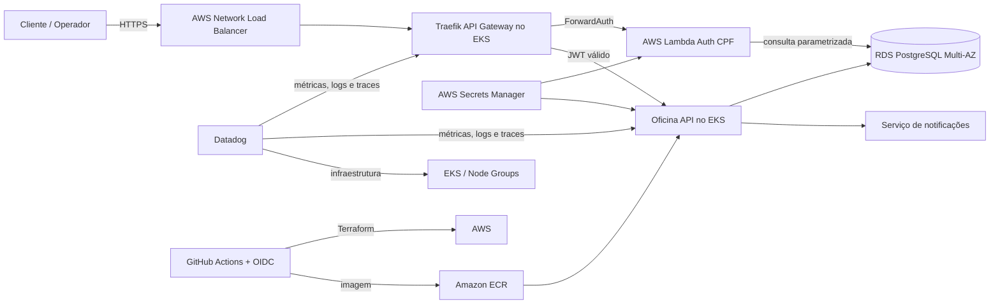

# Diagrama de Componentes

O Traefik é a única entrada pública das APIs. A aplicação e o banco permanecem em
redes privadas. As pipelines assumem roles temporários via OIDC, sem chaves AWS
permanentes.
