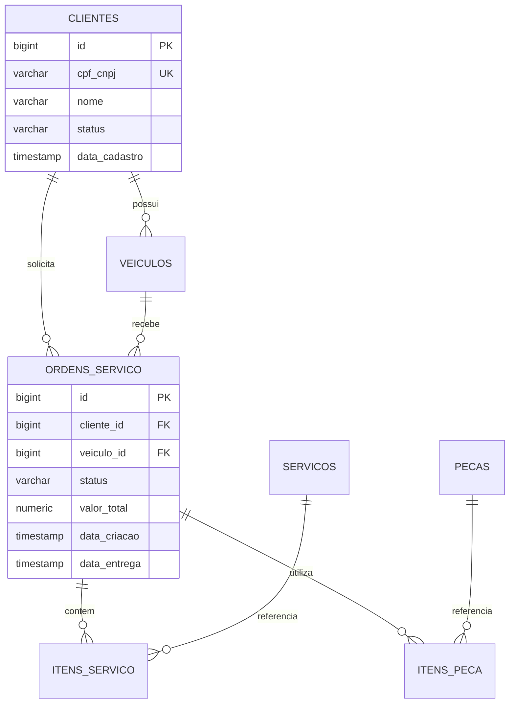

# Modelo Relacional e Justificativa

## Diagrama ER

## Justificativa

PostgreSQL foi mantido porque o domínio exige transações consistentes entre ordem,
itens e estoque, integridade referencial e consultas analíticas por status e período.
RDS reduz o trabalho operacional com backup, patching, criptografia, monitoramento e
Multi-AZ, preservando SQL e compatibilidade com JPA/Flyway.

O schema agora é governado pelo Flyway. Constraints impedem status desconhecidos,
estoque negativo e quantidades inválidas. Índices cobrem CPF, cliente/veículo das
ordens, fila por status/data e foreign keys dos itens. Produção usa RDS privado,
criptografia KMS, backup de 30 dias, Performance Insights e Multi-AZ.
