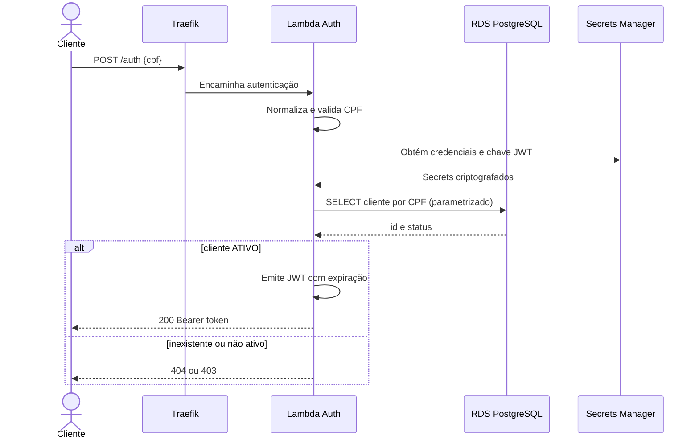
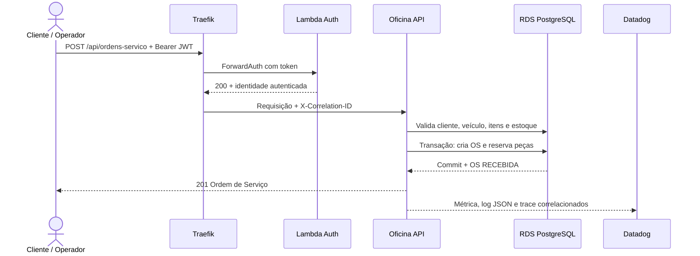

# Diagramas de Sequência

## Autenticação por CPF

```mermaid
sequenceDiagram
    actor C as Cliente
    participant T as Traefik
    participant L as Lambda Auth
    participant DB as RDS PostgreSQL
    participant SM as Secrets Manager
    C->>T: POST /auth {cpf}
    T->>L: Encaminha autenticação
    L->>L: Normaliza e valida CPF
    L->>SM: Obtém credenciais e chave JWT
    SM-->>L: Secrets criptografados
    L->>DB: SELECT cliente por CPF (parametrizado)
    DB-->>L: id e status
    alt cliente ATIVO
        L->>L: Emite JWT com expiração
        L-->>C: 200 Bearer token
    else inexistente ou não ativo
        L-->>C: 404 ou 403
    end
```

## Abertura de ordem de serviço

```mermaid
sequenceDiagram
    actor C as Cliente / Operador
    participant T as Traefik
    participant L as Lambda Auth
    participant A as Oficina API
    participant DB as RDS PostgreSQL
    participant O as Datadog
    C->>T: POST /api/ordens-servico + Bearer JWT
    T->>L: ForwardAuth com token
    L-->>T: 200 + identidade autenticada
    T->>A: Requisição + X-Correlation-ID
    A->>DB: Valida cliente, veículo, itens e estoque
    A->>DB: Transação: cria OS e reserva peças
    DB-->>A: Commit + OS RECEBIDA
    A-->>C: 201 Ordem de Serviço
    A-->>O: Métrica, log JSON e trace correlacionados
```
