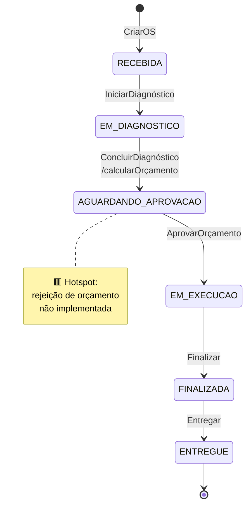

# Event Storming — Ordem de Serviço

Mapeamento completo do fluxo de **criação e acompanhamento da Ordem de Serviço**, do recebimento do veículo até a entrega ao Cliente.

> Legenda das cores → ver [README](README.md#convenções-de-event-storming).

## 1. Big Picture (linha do tempo dos eventos)

Sequência de eventos de domínio relevantes do início ao fim do ciclo de vida da OS:

```mermaid
flowchart LR
    A[🟧 ClienteCadastrado]:::ev --> B[🟧 VeículoCadastrado]:::ev
    B --> C[🟧 OSCriada]:::ev
    C --> D[🟧 DiagnósticoIniciado]:::ev
    D --> E[🟧 ItemServicoAdicionado]:::ev
    D --> F[🟧 ItemPecaAdicionado]:::ev
    E --> G[🟧 DiagnósticoConcluído]:::ev
    F --> G
    G --> H[🟧 OrçamentoGerado]:::ev
    H --> I{Cliente decide}
    I -->|aprova| J[🟧 OrçamentoAprovado]:::ev
    I -->|rejeita 🟥| K[🟥 OrçamentoRejeitado<br/>HOTSPOT — não implementado]:::hot
    J --> L[🟧 ExecuçãoIniciada]:::ev
    L --> M[🟧 PeçasConsumidasNaOS]:::ev
    M --> N[🟧 OSFinalizada]:::ev
    N --> O[🟧 VeículoEntregue]:::ev

    classDef ev fill:#FFA94D,stroke:#E8590C,color:#000
    classDef hot fill:#FF6B6B,stroke:#C92A2A,color:#000
```

## 2. Process Modeling

Detalhamento por etapa: ator → comando → aggregate → eventos → política → read model.

### 2.1 Recepção do veículo e abertura da OS

| Elemento | Conteúdo |
|----------|----------|
| 🟨 Ator | Atendente |
| 🟦 Comando | `CadastrarCliente`, `CadastrarVeículo`, `CriarOS` |
| 🟫 Aggregate | `Cliente`, `Veiculo`, `OrdemServico` |
| 🟧 Eventos | `ClienteCadastrado`, `VeículoCadastrado`, `OSCriada` (status inicial = `RECEBIDA`) |
| 🟪 Política | Se Cliente já existe (mesmo CPF/CNPJ), reutilizar; idem para Veículo (mesma Placa). |
| 🟩 Read Model | Lista de OS por status (`GET /ordens-servico/status/RECEBIDA`) |

### 2.2 Diagnóstico

| Elemento | Conteúdo |
|----------|----------|
| 🟨 Ator | Mecânico |
| 🟦 Comando | `IniciarDiagnóstico`, `AdicionarItemServiço`, `AdicionarItemPeça`, `ConcluirDiagnóstico` |
| 🟫 Aggregate | `OrdemServico` |
| 🟧 Eventos | `DiagnósticoIniciado`, `ItemServicoAdicionado`, `ItemPecaAdicionado`, `DiagnósticoConcluído`, `OrçamentoGerado` |
| 🟪 Política | Ao concluir diagnóstico, **calcular orçamento automaticamente** (`OrdemServico.concluirDiagnostico()` chama `calcularOrcamento()`). |
| 🟪 Política | Ao adicionar `ItemPeça`, verificar se há estoque suficiente (cruza com contexto de Estoque). |
| 🟩 Read Model | Detalhe da OS (`GET /ordens-servico/{id}`) com soma de serviços + peças. |
| 🟥 Hotspot | Não há comando para **remover** itens após adicionados. Validar se é necessário. |

### 2.3 Aprovação do orçamento

| Elemento | Conteúdo |
|----------|----------|
| 🟨 Ator | Cliente (via Atendente) |
| 🟦 Comando | `AprovarOrçamento` |
| 🟫 Aggregate | `OrdemServico` |
| 🟧 Eventos | `OrçamentoAprovado`, `ExecuçãoIniciada` (status → `EM_EXECUCAO`) |
| 🟪 Política | Aprovar só é permitido em `AGUARDANDO_APROVACAO` (invariante em `aprovarOrcamento()`). |
| 🟥 Hotspot | **Rejeição de orçamento** não está implementada. Estados possíveis: orçamento expira? recalcular? cancelar OS? |
| 🟩 Read Model | Lista de OS aguardando aprovação. |

### 2.4 Execução

| Elemento | Conteúdo |
|----------|----------|
| 🟨 Ator | Mecânico |
| 🟦 Comando | `FinalizarOS` |
| 🟫 Aggregate | `OrdemServico` |
| 🟧 Eventos | `PeçasConsumidasNaOS` (cruza com Estoque), `OSFinalizada` |
| 🟪 Política | Ao iniciar execução real, **decrementar estoque** das peças listadas — atualmente fica sob responsabilidade do operador via `PATCH /pecas/{id}/estoque` (🟥 hotspot: ainda não automatizado). |
| 🟩 Read Model | OS em execução, tempo decorrido. |

### 2.5 Entrega

| Elemento | Conteúdo |
|----------|----------|
| 🟨 Ator | Atendente |
| 🟦 Comando | `EntregarVeículo` |
| 🟫 Aggregate | `OrdemServico` |
| 🟧 Eventos | `VeículoEntregue` (status → `ENTREGUE`, `dataEntrega` registrada) |
| 🟪 Política | A diferença entre `dataCriacao` e `dataEntrega` alimenta a métrica de **Tempo Médio de Execução** (`GET /metricas/tempo-medio-execucao`). |
| 🟩 Read Model | Histórico do veículo, métricas operacionais. |

## 3. Diagrama de Estados

Reflete fielmente as transições implementadas em `OrdemServico` (`iniciarDiagnostico`, `concluirDiagnostico`, `aprovarOrcamento`, `finalizar`, `entregar`):

## 4. Invariantes (regras inegociáveis)

1. Toda transição de status valida o estado anterior (`IllegalStateException` em caso de violação).
2. `valorTotal` só faz sentido após `concluirDiagnostico()`; é recalculado deterministicamente a partir dos itens.
3. `dataEntrega` só é preenchida na transição para `ENTREGUE`.
4. OS sempre referencia exatamente um `Cliente` e um `Veículo` (não nulos).

## 5. Hotspots consolidados

- 🟥 **Rejeição de orçamento**: nem comando nem estado existem; precisa decisão de produto.
- 🟥 **Consumo automático de estoque** ao iniciar execução: hoje é manual via PATCH.
- 🟥 **Edição/remoção de itens** após adicionados ao diagnóstico.
- 🟥 **Cancelamento de OS** em qualquer estágio.
