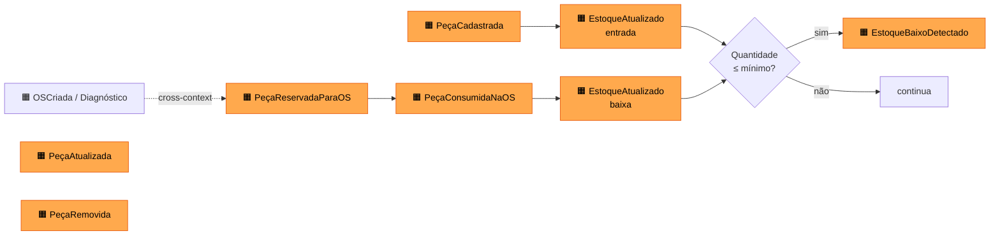

# Event Storming — Gestão de Peças e Insumos

Mapeamento do fluxo de **gestão de peças e insumos** (catálogo + estoque), incluindo a interação com o contexto de Ordem de Serviço.

> Legenda das cores → ver [README](README.md#convenções-de-event-storming).

## 1. Big Picture

## 2. Process Modeling

### 2.1 Cadastro e manutenção do catálogo de Peças

| Elemento | Conteúdo |
|----------|----------|
| 🟨 Ator | Administrador (autenticado via JWT) |
| 🟦 Comando | `CadastrarPeça`, `AtualizarPeça`, `RemoverPeça` |
| 🟫 Aggregate | `Peca` |
| 🟧 Eventos | `PeçaCadastrada`, `PeçaAtualizada`, `PeçaRemovida` |
| 🟪 Política | Não permitir remoção se a Peça estiver vinculada a uma OS ativa (🟥 hotspot — não checado hoje). |
| 🟩 Read Model | `GET /pecas`, `GET /pecas/{id}` |

### 2.2 Entrada de estoque

| Elemento | Conteúdo |
|----------|----------|
| 🟨 Ator | Administrador / Estoquista |
| 🟦 Comando | `AtualizarEstoque(quantidade)` (`PATCH /pecas/{id}/estoque`) |
| 🟫 Aggregate | `Peca` |
| 🟧 Eventos | `EstoqueAtualizado` |
| 🟪 Política | Ao cair abaixo do limite mínimo, emitir alerta `EstoqueBaixoDetectado`. |
| 🟩 Read Model | `GET /pecas/estoque-baixo` |

### 2.3 Consumo de Peça em uma OS (cross-context)

| Elemento | Conteúdo |
|----------|----------|
| 🟨 Ator | Mecânico (durante diagnóstico/execução) |
| 🟦 Comando | `AdicionarItemPeça(osId, pecaId, quantidade)` (no contexto de OS) |
| 🟫 Aggregate | `OrdemServico` (raiz) + `Peca` (consultada) |
| 🟧 Eventos | `ItemPecaAdicionado` (OS), `PeçaConsumidaNaOS` (Estoque) |
| 🟪 Política | Validar `Peca.quantidadeEstoque >= quantidade` antes de aceitar o item. |
| 🟪 Política | Ao mudar OS para `EM_EXECUCAO`, decrementar estoque das peças vinculadas. (🟥 hotspot: hoje é manual.) |
| 🟥 Hotspot | "Reserva" lógica entre o diagnóstico e a aprovação: peça pode ficar indisponível para outras OS? Não definido. |

### 2.4 Alerta de Estoque Baixo

| Elemento | Conteúdo |
|----------|----------|
| 🟪 Política | "Sempre que `EstoqueAtualizado` resultar em `quantidade <= mínimo`, emitir `EstoqueBaixoDetectado`". |
| 🟩 Read Model | Lista de Peças com estoque baixo, consumida por dashboard administrativo. |
| 🟧 Evento | `EstoqueBaixoDetectado` (placeholder; hoje só existe a query). |

## 3. Invariantes

1. `quantidadeEstoque >= 0` em qualquer momento. Tentativa de baixa que torne negativo deve falhar.
2. `valor` da Peça é monetário positivo (`> 0`).
3. Identidade da Peça é seu `id`; descrição não é única (peças similares de fornecedores diferentes podem coexistir).

## 4. Comandos x Endpoints

| Comando | Endpoint REST |
|---------|---------------|
| `CadastrarPeça` | `POST /pecas` |
| `AtualizarPeça` | `PUT /pecas/{id}` |
| `RemoverPeça` | `DELETE /pecas/{id}` |
| `AtualizarEstoque` | `PATCH /pecas/{id}/estoque` |
| `ConsultarPeça` | `GET /pecas/{id}` |
| `ListarPeças` | `GET /pecas` |
| `ListarEstoqueBaixo` | `GET /pecas/estoque-baixo` |

## 5. Hotspots

- 🟥 Reserva lógica de peça durante a fase `AGUARDANDO_APROVACAO`.
- 🟥 Decremento automático de estoque ao iniciar `EM_EXECUCAO`.
- 🟥 Bloqueio de remoção de Peça vinculada a OS ativa.
- 🟥 Histórico de movimentação de estoque (auditoria) ainda não modelado.
