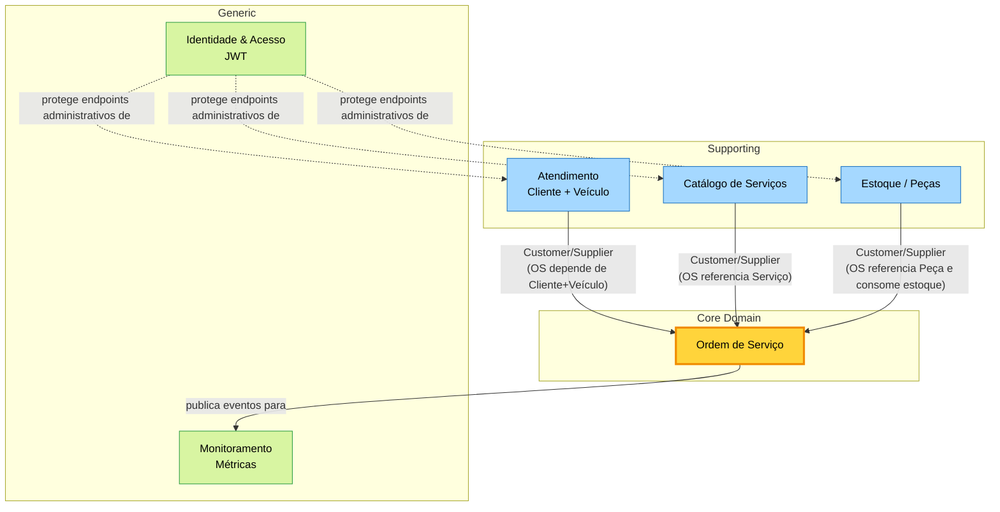

# Bounded Contexts & Context Map

Visão estratégica do domínio: como dividimos o sistema em **Bounded Contexts** e como eles se relacionam.

## 1. Lista de Bounded Contexts

| Contexto | Responsabilidade | Aggregates principais |
|----------|------------------|-----------------------|
| **Atendimento** | Cadastro e manutenção de Clientes e seus Veículos. | `Cliente` (root), `Veiculo` |
| **Catálogo de Serviços** | Definição dos serviços que a oficina executa (descrição, valor base, tempo estimado). | `Servico` |
| **Estoque / Peças** | Catálogo de peças/insumos e controle de estoque. | `Peca` |
| **Ordem de Serviço** | Coração operacional: ciclo de vida da OS, orçamento, execução, entrega. | `OrdemServico` (root), `ItemServico`, `ItemPeca` |
| **Identidade & Acesso** | Autenticação JWT e autorização de endpoints administrativos. | `Usuario` |
| **Monitoramento** | Métricas operacionais (ex.: tempo médio de execução). | (read models) |

## 2. Context Map

## 3. Relacionamentos (Padrões Estratégicos)

| Origem → Destino | Padrão | Descrição |
|------------------|--------|-----------|
| Atendimento → OS | **Customer/Supplier** | OS é Customer; Atendimento é Supplier. OS exige a presença de Cliente e Veículo válidos antes de ser criada. |
| Catálogo de Serviços → OS | **Customer/Supplier** | OS referencia Serviços do catálogo (apenas leitura). |
| Estoque → OS | **Customer/Supplier** com **Anti-Corruption Layer** lógica | OS valida disponibilidade e dispara consumo. ACL implícita: OS não modifica diretamente o aggregate `Peca`; usa o serviço de estoque. |
| OS → Monitoramento | **Open Host Service** (futuro) | Monitoramento consome eventos/queries da OS (`tempo médio`). Hoje, leitura direta do banco. |
| IAM → demais contextos | **Conformist** | Os outros contextos aceitam a representação de Usuário/JWT como o IAM define. |

## 4. Classificação Core / Supporting / Generic

- 🟡 **Core Domain — Ordem de Serviço**: é onde está a vantagem competitiva da oficina (qualidade do fluxo, rastreabilidade, métricas). Concentrar maior esforço de modelagem aqui.
- 🔵 **Supporting — Atendimento, Catálogo, Estoque**: necessários, mas não diferenciadores. Modelagem suficiente para suportar o Core.
- 🟢 **Generic — IAM, Monitoramento**: candidatos a soluções de prateleira (Spring Security/JWT já usado; métricas via Actuator no futuro).

## 5. Mapeamento Bounded Context → Pacote Java

| Contexto | Pacote raiz |
|----------|-------------|
| Atendimento | `com.oficina.mecanica.domain.entities.Cliente`, `Veiculo` |
| Catálogo de Serviços | `com.oficina.mecanica.domain.entities.Servico` |
| Estoque / Peças | `com.oficina.mecanica.domain.entities.Peca` |
| Ordem de Serviço | `com.oficina.mecanica.domain.entities.OrdemServico`, `ItemServico`, `ItemPeca` |
| IAM | (Spring Security + JWT em `infrastructure.security` / serviços de auth) |
| Monitoramento | endpoint `GET /api/metricas/*` |

> **Decisão arquitetural**: o MVP mantém **um único módulo Maven**. A separação por Bounded Context é feita pela convenção de pacotes e pelos Aggregates Roots. Em uma evolução futura, cada contexto pode virar um módulo/serviço independente.
