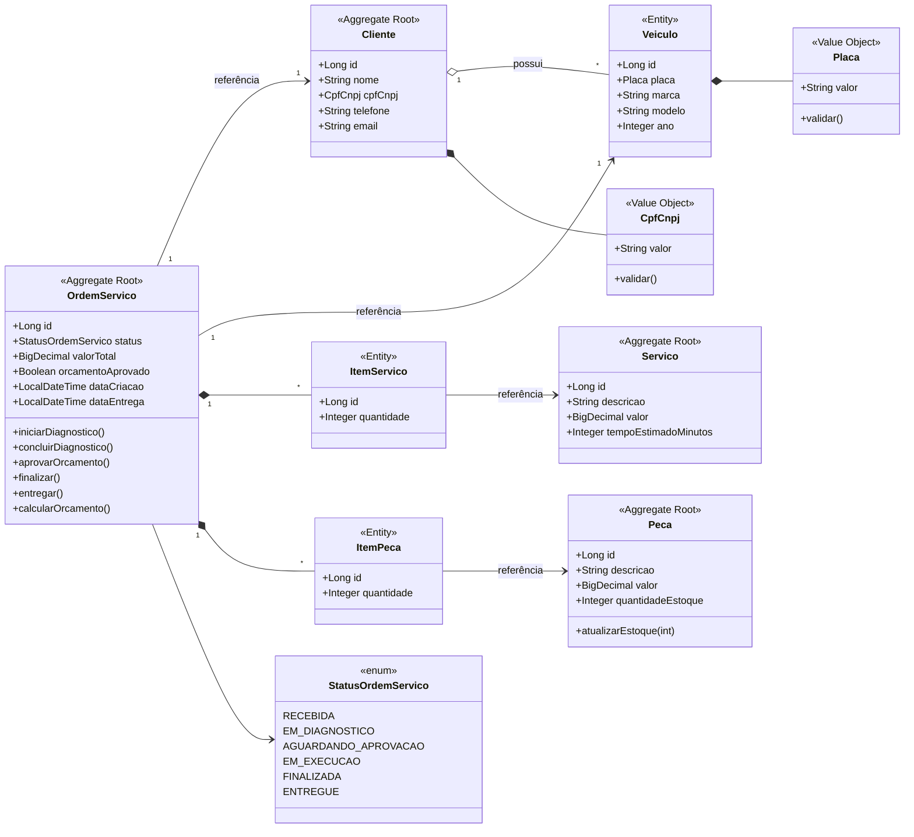
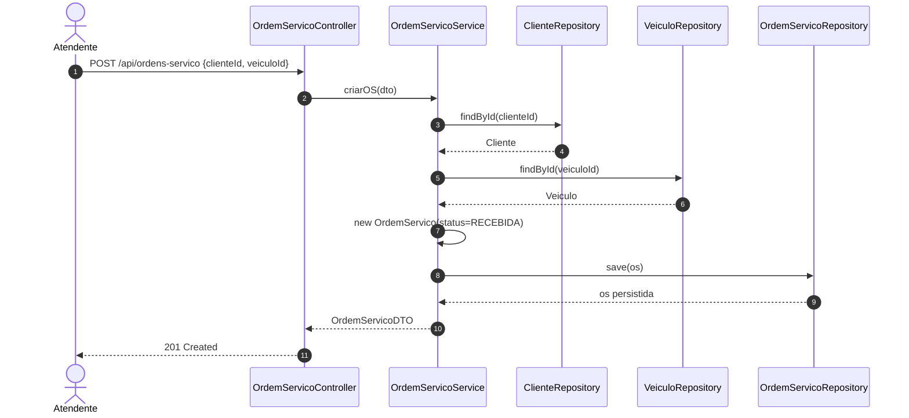
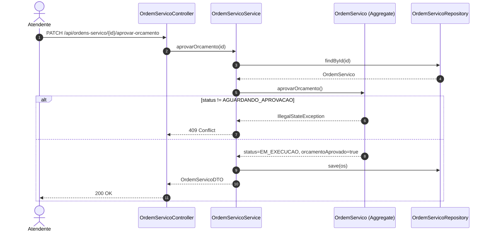
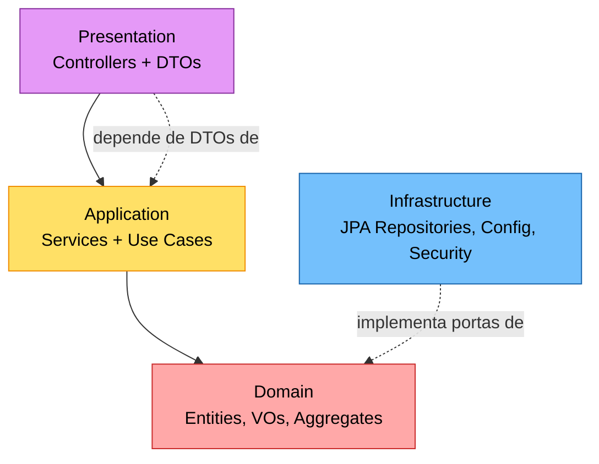

# Design Level — Aggregates, Entidades e Value Objects

Modelo tático DDD do sistema. Todos os elementos refletem o código atual em `src/main/java/com/oficina/mecanica/domain/`.

## 1. Diagrama de Classes (Aggregates)

## 2. Aggregates × Invariantes × Repositórios

| Aggregate Root | Invariantes principais | Repositório (porta) |
|----------------|------------------------|---------------------|
| `Cliente` | CPF/CNPJ válido e único; nome obrigatório; pode possuir 0..N `Veiculo`. | `ClienteRepository` |
| `Veiculo` | Placa válida e única; pertence a exatamente 1 Cliente. (No MVP, modelado como aggregate root próprio para reuso de queries.) | `VeiculoRepository` |
| `Servico` | Valor > 0; descrição obrigatória. | `ServicoRepository` |
| `Peca` | `quantidadeEstoque >= 0`; valor > 0. | `PecaRepository` |
| `OrdemServico` | Transições de status válidas; `valorTotal` derivado dos itens; sempre referencia 1 Cliente + 1 Veículo. | `OrdemServicoRepository` |

> **Regra geral**: cada operação de mudança de estado de OS usa **um único Aggregate por transação** (consistência forte interna), e referencia outros aggregates **apenas por id** quando possível.

## 3. Diagrama de Sequência — Criar OS

## 4. Diagrama de Sequência — Aprovar Orçamento

## 5. Camadas DDD do projeto

| Camada | Pacote |
|--------|--------|
| Presentation | `presentation.rest` |
| Application | `application.services`, `application.dto` |
| Domain | `domain.entities`, `domain.valueobjects` |
| Infrastructure | `infrastructure.persistence`, `infrastructure.security`, `infrastructure.config` |

## 6. Decisões de modelagem relevantes

- **`Veiculo` como aggregate root próprio**: facilita consultas por placa e listagens, mesmo que conceitualmente seja parte do agregado Cliente. Trade-off consciente para suportar APIs `GET /api/veiculos/placa/{placa}`.
- **`ItemServico` e `ItemPeca` são entidades internas** do agregado `OrdemServico`: ciclo de vida atrelado à OS, não acessíveis fora dela.
- **`StatusOrdemServico` como enum**: máquina de estados pequena e estável; transições protegidas por métodos de domínio em `OrdemServico`.
- **`calcularOrcamento()` é determinístico**: não persiste eventos, apenas recalcula `valorTotal` a partir dos itens — pode ser chamado várias vezes.
