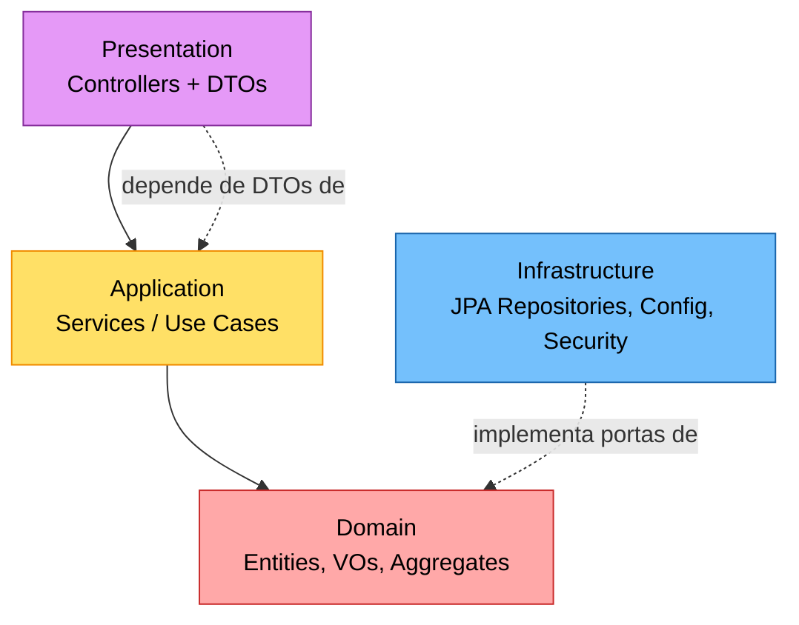
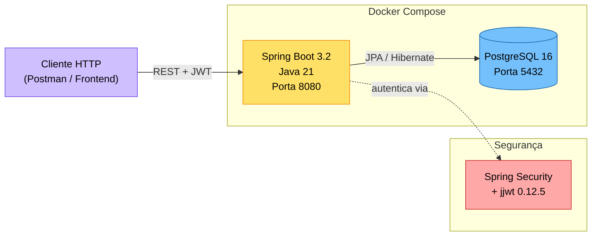

# Documentação DDD — Oficina Mecânica Tech

Documentação de Domínio do MVP de back-end para o sistema integrado de atendimento e execução de serviços de oficina mecânica, seguindo os princípios de Domain-Driven Design.

> **Nota sobre a entrega "Miro ou equivalente"**: optamos por versionar a documentação DDD diretamente no repositório, em Markdown + Mermaid, garantindo rastreabilidade junto ao código, renderização nativa no GitHub e revisão por Pull Request. Esta pasta é o equivalente ao board do Miro.

## Colaboradores

- **Danilo Ischiavolini Chaves**
- **Rodrigo Dias Bragantini**
- **William de Oliveira Almeida**

## Como ler esta documentação

Recomendamos ler na ordem abaixo, do mais amplo (visão estratégica) ao mais detalhado (modelo de implementação):

1. **[Linguagem Ubíqua](01-linguagem-ubiqua.md)** — Glossário compartilhado entre negócio e time técnico.
2. **[Event Storming — Ordem de Serviço](02-event-storming-os.md)** — Big Picture e Process Modeling do ciclo de vida da OS.
3. **[Event Storming — Peças e Insumos](03-event-storming-pecas.md)** — Big Picture e Process Modeling da gestão de estoque.
4. **[Bounded Contexts & Context Map](04-bounded-contexts.md)** — Visão estratégica dos contextos e suas relações.
5. **[Design Level — Aggregates e Diagramas](05-design-level.md)** — Modelo tático: Aggregates, Entidades, Value Objects, invariantes.
6. **[Casos de Uso](06-casos-de-uso.md)** — Rastreabilidade entre use cases, services e endpoints REST.

## Convenções de Event Storming

Seguimos a notação clássica de Alberto Brandolini, mapeando as cores do post-it para emojis (já que a documentação é textual):

| Símbolo | Elemento | Significado |
|---------|----------|-------------|
| 🟧 | **Evento de Domínio** | Algo relevante que aconteceu no passado (verbo no particípio): `OSCriada`, `OrçamentoAprovado` |
| 🟦 | **Comando** | Intenção de ação, gera um ou mais eventos: `CriarOS`, `AprovarOrçamento` |
| 🟨 | **Ator / Usuário** | Quem dispara o comando: Atendente, Mecânico, Cliente |
| 🟪 | **Política / Reação** | "Sempre que X acontecer, então Y": disparo automático |
| 🟩 | **Read Model / View** | Informação que o ator consulta para decidir |
| 🟥 | **Hotspot** | Dúvida, conflito ou regra ainda não resolvida |
| 🟫 | **Aggregate** | Onde o estado é protegido; recebe comandos e emite eventos |
| 🟦‍📦 | **Sistema Externo** | Integração fora do bounded context |

## Escopo coberto

- ✅ Fluxo de criação e acompanhamento da Ordem de Serviço
- ✅ Fluxo de gestão de peças e insumos (estoque)
- ✅ Diagramas DDD (Context Map, Aggregates, Sequence, State)
- ✅ Linguagem Ubíqua consolidada
- ✅ Mapeamento Use Case → Service → Endpoint REST

## Arquitetura

### Camadas DDD

### Arquitetura de Deploy

## Referências do código

A documentação foi escrita em conjunto com o código existente em `src/main/java/com/oficina/mecanica/`. Sempre que um termo, regra ou invariante for citado, há referência ao arquivo Java correspondente.
