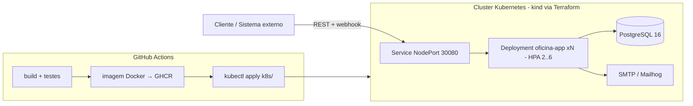

# Fase 2 Tech Challenge — Plano de Implementação

> **For agentic workers:** REQUIRED SUB-SKILL: Use superpowers:subagent-driven-development (recommended) or superpowers:executing-plans to implement this plan task-by-task. Steps use checkbox (`- [ ]`) syntax for tracking.

**Goal:** Evoluir a aplicação da Fase 1 para atender à Fase 2: arquitetura hexagonal (ports & adapters), novas APIs de OS (webhook de orçamento, consulta de status, listagem ordenada com exclusão lógica, notificação por e-mail), manifestos Kubernetes em `/k8s`, Terraform em `/infra` e pipeline CI/CD completa.

**Architecture:** Arquitetura hexagonal pragmática: as interfaces de repositório (ports) passam para `domain/repositories`; as interfaces Spring Data viram adapters em `infrastructure/persistence` que estendem o port. Entidades de domínio mantêm anotações JPA (tradeoff documentado — evita duplicar modelo em um MVP). Notificação de e-mail entra como port de domínio + adapter SMTP. Infra: kind (cluster local) provisionado por Terraform, manifestos K8s completos em `/k8s`, CD demonstrada em kind dentro do runner do GitHub Actions.

**Tech Stack:** Java 21, Spring Boot 3.2.5, Maven, PostgreSQL 16, JUnit 5 + Mockito + Testcontainers/H2, Docker, Kubernetes (kind), Terraform, GitHub Actions, Mailhog (SMTP dev).

## Global Constraints

- Java 21, Spring Boot 3.2.5 (parent) — não alterar versões.
- Build/teste: `mvn -B clean verify` deve passar após CADA task (Jacoco com gate de cobertura já configurado).
- Pacote raiz: `com.oficina.mecanica`. Jar final: `target/oficina-mecanica-1.0.0.jar`.
- Manifestos Kubernetes em `/k8s` (exigência do enunciado). Terraform em `/infra` (exigência do enunciado).
- Status válidos da OS (enunciado): Recebida, Diagnóstico, Aguardando Aprovação, Execução, Finalizada, Entregue — adicionamos `CANCELADA` apenas para recusa de orçamento (decisão de domínio documentada no README).
- Ordenação da listagem (enunciado): Em Execução > Aguardando Aprovação > Em Diagnóstico > Recebida; mais antigas primeiro; excluir (lógica, não física) FINALIZADA e ENTREGUE (e CANCELADA).
- Endpoints existentes e seus testes de integração NÃO podem quebrar.
- Commits: conventional commits (`feat:`, `refactor:`, `ci:`, `docs:`, `test:`).
- Idioma do código/domínio: português (seguir linguagem ubíqua de `docs/ddd/01-linguagem-ubiqua.md`).

---

### Task 1: Ports de repositório no domínio (refatoração hexagonal)

**Files:**
- Create: `src/main/java/com/oficina/mecanica/domain/repositories/OrdemServicoRepository.java`
- Create: `src/main/java/com/oficina/mecanica/domain/repositories/ClienteRepository.java`
- Create: `src/main/java/com/oficina/mecanica/domain/repositories/VeiculoRepository.java`
- Create: `src/main/java/com/oficina/mecanica/domain/repositories/ServicoRepository.java`
- Create: `src/main/java/com/oficina/mecanica/domain/repositories/PecaRepository.java`
- Modify: `src/main/java/com/oficina/mecanica/infrastructure/persistence/OrdemServicoRepository.java` → renomear para `OrdemServicoJpaRepository.java` (idem para os outros 4: `ClienteJpaRepository`, `VeiculoJpaRepository`, `ServicoJpaRepository`, `PecaJpaRepository`)
- Modify: `src/main/java/com/oficina/mecanica/application/services/OrdemServicoService.java` (imports), `ClienteService.java`, `VeiculoService.java`, `ServicoService.java`, `PecaService.java`
- Modify: testes que importam `infrastructure.persistence.*` (localizar com grep no Step 1)

**Interfaces:**
- Consumes: entidades de domínio existentes.
- Produces: ports `com.oficina.mecanica.domain.repositories.*Repository` — os services passam a depender SÓ deles. Assinaturas idênticas às usadas hoje pelos services (ex.: `Optional<OrdemServico> findById(Long id)`, `OrdemServico save(OrdemServico os)`, `List<OrdemServico> findByStatus(StatusOrdemServico status)`, `Page<OrdemServico> findAll(Pageable pageable)`, `Double getTempoMedioExecucao()`).

- [ ] **Step 1: Mapear usos atuais**

Run: `grep -rn "infrastructure.persistence" src/ --include='*.java'`
Anotar todos os arquivos (services + testes) que importam os repositórios.

- [ ] **Step 2: Criar os 5 ports no domínio**

Exemplo completo do port de OS (os outros 4 seguem o mesmo padrão, copiando as assinaturas que os services usam hoje):

```java
package com.oficina.mecanica.domain.repositories;

import com.oficina.mecanica.domain.entities.OrdemServico;
import com.oficina.mecanica.domain.entities.StatusOrdemServico;
import org.springframework.data.domain.Page;
import org.springframework.data.domain.Pageable;

import java.util.List;
import java.util.Optional;

// Port hexagonal: a aplicação depende desta interface; o adapter JPA a implementa.
// ponytail: Page/Pageable (Spring Data) tolerados no port para não reescrever a
// paginação do endpoint /paginado; trocar por VO próprio se sair do Spring.
public interface OrdemServicoRepository {
    OrdemServico save(OrdemServico ordemServico);
    Optional<OrdemServico> findById(Long id);
    List<OrdemServico> findAll();
    Page<OrdemServico> findAll(Pageable pageable);
    List<OrdemServico> findByClienteId(Long clienteId);
    List<OrdemServico> findByVeiculoId(Long veiculoId);
    List<OrdemServico> findByStatus(StatusOrdemServico status);
    Double getTempoMedioExecucao();
}
```

Ports restantes — declarar exatamente os métodos que cada service usa (verificados no Step 1). Base:

```java
// ClienteRepository (port)
Cliente save(Cliente c); Optional<Cliente> findById(Long id); List<Cliente> findAll();
Optional<Cliente> findByCpfCnpj(String cpfCnpj); boolean existsByCpfCnpj(String cpfCnpj); void deleteById(Long id);

// VeiculoRepository (port)
Veiculo save(Veiculo v); Optional<Veiculo> findById(Long id); List<Veiculo> findAll();
Optional<Veiculo> findByPlaca(String placa); List<Veiculo> findByClienteId(Long clienteId); void deleteById(Long id);

// ServicoRepository (port)
Servico save(Servico s); Optional<Servico> findById(Long id); List<Servico> findAll(); void deleteById(Long id);

// PecaRepository (port)
Peca save(Peca p); Optional<Peca> findById(Long id); List<Peca> findAll();
List<Peca> findByQuantidadeEstoqueLessThan(Integer limite); void deleteById(Long id);
```

(Ajustar nomes/assinaturas ao que o grep do Step 1 mostrar — a fonte da verdade é o uso real nos services.)

- [ ] **Step 3: Transformar as interfaces Spring Data em adapters**

Renomear cada interface de `infrastructure/persistence` para `*JpaRepository` e estender o port. Exemplo OS:

```java
package com.oficina.mecanica.infrastructure.persistence;

import com.oficina.mecanica.domain.entities.OrdemServico;
import com.oficina.mecanica.domain.repositories.OrdemServicoRepository;
import org.springframework.data.jpa.repository.JpaRepository;
import org.springframework.data.jpa.repository.Query;
import org.springframework.stereotype.Repository;

// Adapter de persistência: Spring Data implementa o port em runtime.
@Repository
public interface OrdemServicoJpaRepository
        extends JpaRepository<OrdemServico, Long>, OrdemServicoRepository {

    @Query(value = "SELECT AVG(EXTRACT(EPOCH FROM (os.data_entrega - os.data_criacao)) / 60) FROM ordens_servico os WHERE os.data_entrega IS NOT NULL", nativeQuery = true)
    Double getTempoMedioExecucao();
}
```

Os métodos derivados (`findByClienteId` etc.) já são gerados pelo Spring Data; as declarações duplicadas na interface antiga podem ser removidas (o port já as declara).

- [ ] **Step 4: Apontar os services para os ports**

Em cada service, trocar `import com.oficina.mecanica.infrastructure.persistence.*;` por `import com.oficina.mecanica.domain.repositories.*;`. Nenhuma outra mudança — os nomes de campo continuam (`ordemServicoRepository` etc.). Corrigir os mesmos imports nos testes mapeados no Step 1 (mocks passam a mockar o port).

- [ ] **Step 5: Rodar a suíte completa**

Run: `mvn -B clean verify`
Expected: BUILD SUCCESS, mesmos ~239 testes passando. A suíte existente É o teste desta refatoração (comportamento não muda).

- [ ] **Step 6: Commit**

```bash
git add src/
git commit -m "refactor: arquitetura hexagonal - ports de repositorio no dominio, adapters JPA na infraestrutura"
```

---

### Task 2: Status CANCELADA + recusa de orçamento no domínio

**Files:**
- Modify: `src/main/java/com/oficina/mecanica/domain/entities/StatusOrdemServico.java`
- Modify: `src/main/java/com/oficina/mecanica/domain/entities/OrdemServico.java`
- Test: `src/test/java/com/oficina/mecanica/domain/entities/OrdemServicoTest.java`

**Interfaces:**
- Produces: `StatusOrdemServico.CANCELADA`; `void OrdemServico.recusarOrcamento()` — lança `IllegalStateException` se status != `AGUARDANDO_APROVACAO`; caso contrário seta `orcamentoAprovado=false` e `status=CANCELADA`. Task 4 (webhook) consome.

- [ ] **Step 1: Escrever os testes que falham**

Adicionar em `OrdemServicoTest.java` (seguir o padrão dos testes existentes na classe):

```java
@Test
void deveRecusarOrcamentoQuandoAguardandoAprovacao() {
    OrdemServico os = OrdemServico.builder()
        .status(StatusOrdemServico.AGUARDANDO_APROVACAO)
        .build();

    os.recusarOrcamento();

    assertEquals(StatusOrdemServico.CANCELADA, os.getStatus());
    assertFalse(os.getOrcamentoAprovado());
}

@Test
void naoDeveRecusarOrcamentoForaDeAguardandoAprovacao() {
    OrdemServico os = OrdemServico.builder()
        .status(StatusOrdemServico.RECEBIDA)
        .build();

    assertThrows(IllegalStateException.class, os::recusarOrcamento);
}
```

- [ ] **Step 2: Rodar e ver falhar**

Run: `mvn -B test -Dtest=OrdemServicoTest`
Expected: FAIL — erro de compilação (`recusarOrcamento`/`CANCELADA` não existem).

- [ ] **Step 3: Implementar**

Em `StatusOrdemServico.java`, adicionar após `ENTREGUE("Entregue")`:

```java
    ENTREGUE("Entregue"),
    CANCELADA("Cancelada");
```

Em `OrdemServico.java`, após `aprovarOrcamento()`:

```java
    public void recusarOrcamento() {
        if (status != StatusOrdemServico.AGUARDANDO_APROVACAO) {
            throw new IllegalStateException("Só é possível recusar orçamento quando status é AGUARDANDO_APROVACAO");
        }
        this.orcamentoAprovado = false;
        this.status = StatusOrdemServico.CANCELADA;
    }
```

- [ ] **Step 4: Rodar e ver passar**

Run: `mvn -B test -Dtest=OrdemServicoTest`
Expected: PASS (todos os testes da classe).

- [ ] **Step 5: Commit**

```bash
git add src/main/java/com/oficina/mecanica/domain/entities/ src/test/java/com/oficina/mecanica/domain/entities/OrdemServicoTest.java
git commit -m "feat: status CANCELADA e recusa de orcamento no dominio da OS"
```

---

### Task 3: Endpoint de consulta de status da OS

**Files:**
- Create: `src/main/java/com/oficina/mecanica/application/dto/StatusOrdemServicoDTO.java`
- Modify: `src/main/java/com/oficina/mecanica/application/services/OrdemServicoService.java`
- Modify: `src/main/java/com/oficina/mecanica/presentation/rest/OrdemServicoController.java`
- Test: `src/test/java/com/oficina/mecanica/integration/OrdemServicoIntegrationTest.java`

**Interfaces:**
- Consumes: `OrdemServicoRepository.findById(Long)` (port da Task 1).
- Produces: `GET /api/ordens-servico/{id}/status` → 200 `{"id":1,"status":"RECEBIDA","descricao":"Recebida"}`; `StatusOrdemServicoDTO consultarStatus(Long id)` no service.

- [ ] **Step 1: Escrever teste de integração que falha**

Adicionar em `OrdemServicoIntegrationTest.java`, seguindo o padrão dos testes existentes (mesma forma de criar OS e autenticar usada pela classe):

```java
@Test
void deveConsultarStatusDaOS() throws Exception {
    Long osId = criarOrdemServico(); // reutilizar o helper que a classe já usa para criar OS

    mockMvc.perform(get("/api/ordens-servico/" + osId + "/status"))
        .andExpect(status().isOk())
        .andExpect(jsonPath("$.id").value(osId))
        .andExpect(jsonPath("$.status").value("RECEBIDA"))
        .andExpect(jsonPath("$.descricao").value("Recebida"));
}
```

(Se a classe não tiver helper de criação, replicar o arranjo do teste de criação de OS existente.)

- [ ] **Step 2: Rodar e ver falhar**

Run: `mvn -B test -Dtest=OrdemServicoIntegrationTest#deveConsultarStatusDaOS`
Expected: FAIL com 404 ou erro de compilação.

- [ ] **Step 3: Implementar DTO, service e controller**

`StatusOrdemServicoDTO.java`:

```java
package com.oficina.mecanica.application.dto;

import com.oficina.mecanica.domain.entities.StatusOrdemServico;
import lombok.AllArgsConstructor;
import lombok.Builder;
import lombok.Data;
import lombok.NoArgsConstructor;

@Data
@Builder
@NoArgsConstructor
@AllArgsConstructor
public class StatusOrdemServicoDTO {
    private Long id;
    private StatusOrdemServico status;
    private String descricao;
}
```

Em `OrdemServicoService.java`:

```java
    @Transactional(readOnly = true)
    public StatusOrdemServicoDTO consultarStatus(Long id) {
        OrdemServico os = ordemServicoRepository.findById(id)
            .orElseThrow(() -> new IllegalArgumentException("Ordem de Serviço não encontrada"));
        return StatusOrdemServicoDTO.builder()
            .id(os.getId())
            .status(os.getStatus())
            .descricao(os.getStatus().getDescricao())
            .build();
    }
```

Em `OrdemServicoController.java`:

```java
    @GetMapping("/{id}/status")
    @Operation(summary = "Consultar situação atual da OS")
    public ResponseEntity<StatusOrdemServicoDTO> consultarStatus(@PathVariable Long id) {
        return ResponseEntity.ok(ordemServicoService.consultarStatus(id));
    }
```

(import de `StatusOrdemServicoDTO` no controller.)

- [ ] **Step 4: Rodar e ver passar**

Run: `mvn -B test -Dtest=OrdemServicoIntegrationTest`
Expected: PASS.

- [ ] **Step 5: Commit**

```bash
git add src/
git commit -m "feat: endpoint de consulta de status da OS"
```

---

### Task 4: Webhook de aprovação/recusa de orçamento

**Files:**
- Create: `src/main/java/com/oficina/mecanica/application/dto/NotificacaoOrcamentoDTO.java`
- Create: `src/main/java/com/oficina/mecanica/presentation/rest/WebhookController.java`
- Modify: `src/main/java/com/oficina/mecanica/application/services/OrdemServicoService.java` (método `recusarOrcamento`)
- Modify: `src/main/java/com/oficina/mecanica/infrastructure/security/SecurityConfig.java`
- Test: `src/test/java/com/oficina/mecanica/integration/OrdemServicoIntegrationTest.java`

**Interfaces:**
- Consumes: `OrdemServico.aprovarOrcamento()` / `OrdemServico.recusarOrcamento()` (Task 2).
- Produces: `POST /api/webhooks/orcamento` (público, sem JWT — é chamado por sistema externo) com body `{"ordemServicoId":1,"aprovado":true}` → 200 com `OrdemServicoDTO`; `OrdemServicoDTO recusarOrcamento(Long id)` no service.

- [ ] **Step 1: Escrever testes de integração que falham**

```java
@Test
void webhookDeveAprovarOrcamento() throws Exception {
    Long osId = criarOsAguardandoAprovacao(); // criar OS e avançar: iniciar-diagnostico + concluir-diagnostico

    mockMvc.perform(post("/api/webhooks/orcamento")
            .contentType(MediaType.APPLICATION_JSON)
            .content("{\"ordemServicoId\":" + osId + ",\"aprovado\":true}"))
        .andExpect(status().isOk())
        .andExpect(jsonPath("$.status").value("EM_EXECUCAO"))
        .andExpect(jsonPath("$.orcamentoAprovado").value(true));
}

@Test
void webhookDeveRecusarOrcamento() throws Exception {
    Long osId = criarOsAguardandoAprovacao();

    mockMvc.perform(post("/api/webhooks/orcamento")
            .contentType(MediaType.APPLICATION_JSON)
            .content("{\"ordemServicoId\":" + osId + ",\"aprovado\":false}"))
        .andExpect(status().isOk())
        .andExpect(jsonPath("$.status").value("CANCELADA"));
}
```

Helper `criarOsAguardandoAprovacao()`: criar OS via padrão existente da classe e chamar `PATCH /api/ordens-servico/{id}/iniciar-diagnostico` e `.../concluir-diagnostico`.

- [ ] **Step 2: Rodar e ver falhar**

Run: `mvn -B test -Dtest=OrdemServicoIntegrationTest#webhookDeveAprovarOrcamento`
Expected: FAIL (404 — rota não existe).

- [ ] **Step 3: Implementar**

`NotificacaoOrcamentoDTO.java`:

```java
package com.oficina.mecanica.application.dto;

import jakarta.validation.constraints.NotNull;
import lombok.AllArgsConstructor;
import lombok.Builder;
import lombok.Data;
import lombok.NoArgsConstructor;

@Data
@Builder
@NoArgsConstructor
@AllArgsConstructor
public class NotificacaoOrcamentoDTO {

    @NotNull(message = "ordemServicoId é obrigatório")
    private Long ordemServicoId;

    @NotNull(message = "aprovado é obrigatório")
    private Boolean aprovado;
}
```

Em `OrdemServicoService.java`, após `aprovarOrcamento`:

```java
    public OrdemServicoDTO recusarOrcamento(Long id) {
        OrdemServico os = ordemServicoRepository.findById(id)
            .orElseThrow(() -> new IllegalArgumentException("Ordem de Serviço não encontrada"));
        os.recusarOrcamento();
        os = ordemServicoRepository.save(os);
        return toDTO(os);
    }
```

`WebhookController.java`:

```java
package com.oficina.mecanica.presentation.rest;

import com.oficina.mecanica.application.dto.NotificacaoOrcamentoDTO;
import com.oficina.mecanica.application.dto.OrdemServicoDTO;
import com.oficina.mecanica.application.services.OrdemServicoService;
import io.swagger.v3.oas.annotations.Operation;
import io.swagger.v3.oas.annotations.tags.Tag;
import jakarta.validation.Valid;
import lombok.RequiredArgsConstructor;
import org.springframework.http.ResponseEntity;
import org.springframework.web.bind.annotation.*;

@RestController
@RequestMapping("/api/webhooks")
@RequiredArgsConstructor
@Tag(name = "Webhooks", description = "Notificações externas (aprovação/recusa de orçamento)")
public class WebhookController {

    private final OrdemServicoService ordemServicoService;

    @PostMapping("/orcamento")
    @Operation(summary = "Receber notificação externa de aprovação ou recusa do orçamento")
    public ResponseEntity<OrdemServicoDTO> notificarOrcamento(@Valid @RequestBody NotificacaoOrcamentoDTO dto) {
        OrdemServicoDTO os = Boolean.TRUE.equals(dto.getAprovado())
            ? ordemServicoService.aprovarOrcamento(dto.getOrdemServicoId())
            : ordemServicoService.recusarOrcamento(dto.getOrdemServicoId());
        return ResponseEntity.ok(os);
    }
}
```

Em `SecurityConfig.java`, adicionar aos matchers permitidos (linha ~31):

```java
                .requestMatchers("/api/webhooks/**").permitAll()
```

- [ ] **Step 4: Rodar e ver passar**

Run: `mvn -B test -Dtest=OrdemServicoIntegrationTest`
Expected: PASS.

- [ ] **Step 5: Commit**

```bash
git add src/
git commit -m "feat: webhook de aprovacao/recusa de orcamento"
```

---

### Task 5: Listagem ordenada por status com exclusão lógica

**Files:**
- Modify: `src/main/java/com/oficina/mecanica/domain/repositories/OrdemServicoRepository.java` (port)
- Modify: `src/main/java/com/oficina/mecanica/infrastructure/persistence/OrdemServicoJpaRepository.java`
- Modify: `src/main/java/com/oficina/mecanica/application/services/OrdemServicoService.java`
- Modify: `src/main/java/com/oficina/mecanica/presentation/rest/OrdemServicoController.java`
- Test: `src/test/java/com/oficina/mecanica/integration/OrdemServicoIntegrationTest.java`

**Interfaces:**
- Produces: `List<OrdemServico> findAtivasOrdenadas()` no port; `GET /api/ordens-servico` passa a retornar a fila ordenada (Em Execução > Aguardando Aprovação > Em Diagnóstico > Recebida, mais antigas primeiro, sem FINALIZADA/ENTREGUE/CANCELADA). A listagem completa continua disponível em `GET /api/ordens-servico/paginado` (exclusão é lógica: dados permanecem no banco e acessíveis por id/paginado).

- [ ] **Step 1: Escrever teste de integração que falha**

```java
@Test
void listagemDeveOrdenarPorStatusEExcluirFinalizadasEEntregues() throws Exception {
    Long osRecebida = criarOrdemServico();
    Long osEmDiagnostico = criarOrdemServico();
    mockMvc.perform(patch("/api/ordens-servico/" + osEmDiagnostico + "/iniciar-diagnostico"));
    Long osEmExecucao = criarOsAguardandoAprovacao();
    mockMvc.perform(patch("/api/ordens-servico/" + osEmExecucao + "/aprovar-orcamento"));
    Long osEntregue = criarOsAguardandoAprovacao();
    mockMvc.perform(patch("/api/ordens-servico/" + osEntregue + "/aprovar-orcamento"));
    mockMvc.perform(patch("/api/ordens-servico/" + osEntregue + "/finalizar"));
    mockMvc.perform(patch("/api/ordens-servico/" + osEntregue + "/entregar"));

    mockMvc.perform(get("/api/ordens-servico"))
        .andExpect(status().isOk())
        .andExpect(jsonPath("$.length()").value(3))
        .andExpect(jsonPath("$[0].id").value(osEmExecucao))
        .andExpect(jsonPath("$[1].id").value(osEmDiagnostico))
        .andExpect(jsonPath("$[2].id").value(osRecebida));
}
```

(Base limpa por teste — a classe de integração já recria o schema/dados; conferir e ajustar contagem se houver seed.)

- [ ] **Step 2: Rodar e ver falhar**

Run: `mvn -B test -Dtest=OrdemServicoIntegrationTest#listagemDeveOrdenarPorStatusEExcluirFinalizadasEEntregues`
Expected: FAIL (retorna 4 itens, ordem de inserção).

- [ ] **Step 3: Implementar query, service e controller**

No port `domain/repositories/OrdemServicoRepository.java`:

```java
    List<OrdemServico> findAtivasOrdenadas();
```

No adapter `OrdemServicoJpaRepository.java`:

```java
    @Query("""
        SELECT os FROM OrdemServico os
        WHERE os.status NOT IN (com.oficina.mecanica.domain.entities.StatusOrdemServico.FINALIZADA,
                                com.oficina.mecanica.domain.entities.StatusOrdemServico.ENTREGUE,
                                com.oficina.mecanica.domain.entities.StatusOrdemServico.CANCELADA)
        ORDER BY CASE os.status
            WHEN com.oficina.mecanica.domain.entities.StatusOrdemServico.EM_EXECUCAO THEN 1
            WHEN com.oficina.mecanica.domain.entities.StatusOrdemServico.AGUARDANDO_APROVACAO THEN 2
            WHEN com.oficina.mecanica.domain.entities.StatusOrdemServico.EM_DIAGNOSTICO THEN 3
            ELSE 4
        END, os.dataCriacao ASC
        """)
    List<OrdemServico> findAtivasOrdenadas();
```

No service:

```java
    @Transactional(readOnly = true)
    public List<OrdemServicoDTO> listarAtivas() {
        return ordemServicoRepository.findAtivasOrdenadas().stream()
            .map(this::toDTO)
            .collect(Collectors.toList());
    }
```

No controller, trocar o corpo de `listarTodos()`:

```java
    @GetMapping
    @Operation(summary = "Listar OS ativas ordenadas por prioridade de status (exclui finalizadas/entregues)")
    public ResponseEntity<List<OrdemServicoDTO>> listarTodos() {
        return ResponseEntity.ok(ordemServicoService.listarAtivas());
    }
```

- [ ] **Step 4: Rodar a suíte inteira (o contrato do GET mudou)**

Run: `mvn -B clean verify`
Expected: BUILD SUCCESS. Se algum teste antigo esperava OS finalizadas no GET raiz, atualizar esse teste para usar `/paginado` (comportamento novo é o exigido pelo enunciado).

- [ ] **Step 5: Commit**

```bash
git add src/
git commit -m "feat: listagem de OS ordenada por status com exclusao logica de finalizadas/entregues"
```

---

### Task 6: Notificação de mudança de status por e-mail

**Files:**
- Create: `src/main/java/com/oficina/mecanica/domain/repositories/NotificacaoPort.java`
- Create: `src/main/java/com/oficina/mecanica/infrastructure/notification/EmailNotificacaoAdapter.java`
- Modify: `pom.xml` (spring-boot-starter-mail)
- Modify: `src/main/resources/application.yml` (config de mail)
- Modify: `src/test/resources/application-test.yml` (mail apontando para localhost, sem envio real)
- Modify: `src/main/java/com/oficina/mecanica/application/services/OrdemServicoService.java`
- Modify: `docker-compose.yml` (Mailhog)
- Test: `src/test/java/com/oficina/mecanica/application/services/OrdemServicoServiceNotificacaoTest.java` (novo)

**Interfaces:**
- Consumes: `OrdemServico` (cliente.email já existe na entidade `Cliente`).
- Produces: port `NotificacaoPort { void notificarMudancaStatus(OrdemServico os); }`; adapter SMTP best-effort (falha de e-mail NUNCA derruba a transação). Chamado em todas as transições: iniciarDiagnostico, concluirDiagnostico, aprovarOrcamento, recusarOrcamento, finalizar, entregar.

- [ ] **Step 1: Escrever teste unitário que falha**

`OrdemServicoServiceNotificacaoTest.java`:

```java
package com.oficina.mecanica.application.services;

import com.oficina.mecanica.domain.entities.*;
import com.oficina.mecanica.domain.repositories.*;
import org.junit.jupiter.api.Test;
import org.junit.jupiter.api.extension.ExtendWith;
import org.mockito.InjectMocks;
import org.mockito.Mock;
import org.mockito.junit.jupiter.MockitoExtension;

import java.util.Optional;

import static org.mockito.ArgumentMatchers.any;
import static org.mockito.Mockito.*;

@ExtendWith(MockitoExtension.class)
class OrdemServicoServiceNotificacaoTest {

    @Mock private OrdemServicoRepository ordemServicoRepository;
    @Mock private ClienteRepository clienteRepository;
    @Mock private VeiculoRepository veiculoRepository;
    @Mock private ServicoRepository servicoRepository;
    @Mock private PecaRepository pecaRepository;
    @Mock private NotificacaoPort notificacaoPort;

    @InjectMocks private OrdemServicoService service;

    private OrdemServico osRecebida() {
        Cliente cliente = Cliente.builder().id(1L).nome("Ana").email("ana@ex.com").build();
        Veiculo veiculo = Veiculo.builder().id(1L).build();
        return OrdemServico.builder().id(1L).cliente(cliente).veiculo(veiculo)
            .status(StatusOrdemServico.RECEBIDA).build();
    }

    @Test
    void deveNotificarAoIniciarDiagnostico() {
        OrdemServico os = osRecebida();
        when(ordemServicoRepository.findById(1L)).thenReturn(Optional.of(os));
        when(ordemServicoRepository.save(any())).thenReturn(os);

        service.iniciarDiagnostico(1L);

        verify(notificacaoPort).notificarMudancaStatus(os);
    }
}
```

(Ajustar builders de `Cliente`/`Veiculo` aos campos reais se `placa` for obrigatória no `toDTO` — usar `Veiculo.builder().id(1L).placa(...)...` conforme os testes unitários existentes fazem.)

- [ ] **Step 2: Rodar e ver falhar**

Run: `mvn -B test -Dtest=OrdemServicoServiceNotificacaoTest`
Expected: FAIL (NotificacaoPort não existe).

- [ ] **Step 3: Implementar port, adapter, wiring e config**

`NotificacaoPort.java`:

```java
package com.oficina.mecanica.domain.repositories;

import com.oficina.mecanica.domain.entities.OrdemServico;

public interface NotificacaoPort {
    void notificarMudancaStatus(OrdemServico ordemServico);
}
```

`EmailNotificacaoAdapter.java`:

```java
package com.oficina.mecanica.infrastructure.notification;

import com.oficina.mecanica.domain.entities.OrdemServico;
import com.oficina.mecanica.domain.repositories.NotificacaoPort;
import lombok.RequiredArgsConstructor;
import lombok.extern.slf4j.Slf4j;
import org.springframework.mail.SimpleMailMessage;
import org.springframework.mail.javamail.JavaMailSender;
import org.springframework.stereotype.Component;

@Component
@RequiredArgsConstructor
@Slf4j
public class EmailNotificacaoAdapter implements NotificacaoPort {

    private final JavaMailSender mailSender;

    @Override
    public void notificarMudancaStatus(OrdemServico os) {
        try {
            SimpleMailMessage msg = new SimpleMailMessage();
            msg.setFrom("oficina@oficinamecanica.com");
            msg.setTo(os.getCliente().getEmail());
            msg.setSubject("OS #" + os.getId() + " - " + os.getStatus().getDescricao());
            msg.setText("Olá, " + os.getCliente().getNome()
                + "! Sua ordem de serviço #" + os.getId()
                + " mudou para o status: " + os.getStatus().getDescricao() + ".");
            mailSender.send(msg);
        } catch (Exception e) {
            // ponytail: best-effort — falha de SMTP não pode abortar a transição de status
            log.warn("Falha ao enviar e-mail de notificação da OS {}: {}", os.getId(), e.getMessage());
        }
    }
}
```

`pom.xml` — junto às demais starters:

```xml
        <dependency>
            <groupId>org.springframework.boot</groupId>
            <artifactId>spring-boot-starter-mail</artifactId>
        </dependency>
```

`application.yml` — dentro de `spring:`:

```yaml
  mail:
    host: ${MAIL_HOST:localhost}
    port: ${MAIL_PORT:1025}
```

`application-test.yml` — dentro de `spring:` (não envia nada em teste; adapter engole a falha de conexão):

```yaml
  mail:
    host: localhost
    port: 3025
```

`OrdemServicoService.java` — adicionar o campo e chamar após cada transição salva:

```java
    private final NotificacaoPort notificacaoPort;
```

Em `iniciarDiagnostico`, `concluirDiagnostico`, `aprovarOrcamento`, `recusarOrcamento`, `finalizar`, `entregar`, inserir antes do `return toDTO(os);`:

```java
        notificacaoPort.notificarMudancaStatus(os);
```

`docker-compose.yml` — novo serviço + env no app:

```yaml
  mailhog:
    image: mailhog/mailhog:v1.0.1
    container_name: oficina-mailhog
    ports:
      - "1025:1025"
      - "8025:8025"
```

E no serviço `app`, em `environment`:

```yaml
      MAIL_HOST: mailhog
      MAIL_PORT: 1025
```

- [ ] **Step 4: Rodar a suíte completa**

Run: `mvn -B clean verify`
Expected: BUILD SUCCESS. Testes de integração das transições continuam passando (adapter loga warn de SMTP indisponível, não quebra).

- [ ] **Step 5: Verificação manual (opcional, para o vídeo)**

Run: `docker compose up -d --build` → criar OS, avançar status, abrir http://localhost:8025 e ver o e-mail no Mailhog.

- [ ] **Step 6: Commit**

```bash
git add pom.xml src/ docker-compose.yml
git commit -m "feat: notificacao de mudanca de status da OS por e-mail (port + adapter SMTP, Mailhog no compose)"
```

---

### Task 7: Manifestos Kubernetes em /k8s

**Files:**
- Modify: `pom.xml` (spring-boot-starter-actuator — probes)
- Modify: `src/main/resources/application.yml` (expor health)
- Create: `k8s/namespace.yaml`
- Create: `k8s/postgres-secret.yaml`
- Create: `k8s/postgres.yaml`
- Create: `k8s/app-configmap.yaml`
- Create: `k8s/app-secret.yaml`
- Create: `k8s/app-deployment.yaml`
- Create: `k8s/app-service.yaml`
- Create: `k8s/app-hpa.yaml`

**Interfaces:**
- Consumes: imagem Docker do app (`ghcr.io/<owner>/oficina-mecanica`, tag definida na Task 9 — usar `latest` nos manifestos).
- Produces: `kubectl apply -f k8s/` sobe banco + app + HPA no namespace `oficina`; endpoint de health `GET /actuator/health` (probes). Task 8 (Terraform) cria o cluster onde isso é aplicado; Task 9 (CD) aplica os manifestos.

- [ ] **Step 1: Habilitar actuator**

`pom.xml`:

```xml
        <dependency>
            <groupId>org.springframework.boot</groupId>
            <artifactId>spring-boot-starter-actuator</artifactId>
        </dependency>
```

`application.yml` (raiz do arquivo):

```yaml
management:
  endpoints:
    web:
      exposure:
        include: health
  endpoint:
    health:
      probes:
        enabled: true
```

`SecurityConfig.java` — permitir health:

```java
                .requestMatchers("/actuator/health/**", "/actuator/health").permitAll()
```

Run: `mvn -B clean verify` → BUILD SUCCESS.

- [ ] **Step 2: Escrever os manifestos**

`k8s/namespace.yaml`:

```yaml
apiVersion: v1
kind: Namespace
metadata:
  name: oficina
```

`k8s/postgres-secret.yaml`:

```yaml
apiVersion: v1
kind: Secret
metadata:
  name: postgres-secret
  namespace: oficina
type: Opaque
stringData:
  POSTGRES_DB: oficina_mecanica
  POSTGRES_USER: oficina
  POSTGRES_PASSWORD: oficina123   # ponytail: valor dev; em cloud, injetar via CI/sealed-secrets
```

`k8s/postgres.yaml`:

```yaml
apiVersion: v1
kind: PersistentVolumeClaim
metadata:
  name: postgres-pvc
  namespace: oficina
spec:
  accessModes: ["ReadWriteOnce"]
  resources:
    requests:
      storage: 1Gi
---
apiVersion: apps/v1
kind: Deployment
metadata:
  name: postgres
  namespace: oficina
spec:
  replicas: 1
  selector:
    matchLabels:
      app: postgres
  template:
    metadata:
      labels:
        app: postgres
    spec:
      containers:
        - name: postgres
          image: postgres:16-alpine
          ports:
            - containerPort: 5432
          envFrom:
            - secretRef:
                name: postgres-secret
          volumeMounts:
            - name: data
              mountPath: /var/lib/postgresql/data
          resources:
            requests: { cpu: 100m, memory: 256Mi }
            limits: { cpu: 500m, memory: 512Mi }
          readinessProbe:
            exec:
              command: ["pg_isready", "-U", "oficina", "-d", "oficina_mecanica"]
            initialDelaySeconds: 5
            periodSeconds: 10
      volumes:
        - name: data
          persistentVolumeClaim:
            claimName: postgres-pvc
---
apiVersion: v1
kind: Service
metadata:
  name: postgres
  namespace: oficina
spec:
  selector:
    app: postgres
  ports:
    - port: 5432
      targetPort: 5432
```

`k8s/app-configmap.yaml`:

```yaml
apiVersion: v1
kind: ConfigMap
metadata:
  name: oficina-app-config
  namespace: oficina
data:
  DB_URL: jdbc:postgresql://postgres:5432/oficina_mecanica
  MAIL_HOST: mailhog
  MAIL_PORT: "1025"
```

`k8s/app-secret.yaml`:

```yaml
apiVersion: v1
kind: Secret
metadata:
  name: oficina-app-secret
  namespace: oficina
type: Opaque
stringData:
  DB_USERNAME: oficina
  DB_PASSWORD: oficina123
  JWT_SECRET: oficinaMecanicaSecretKeyForJWTTokenGeneration2024
```

`k8s/app-deployment.yaml`:

```yaml
apiVersion: apps/v1
kind: Deployment
metadata:
  name: oficina-app
  namespace: oficina
spec:
  replicas: 2
  selector:
    matchLabels:
      app: oficina-app
  template:
    metadata:
      labels:
        app: oficina-app
    spec:
      containers:
        - name: oficina-app
          image: ghcr.io/OWNER/oficina-mecanica:latest   # OWNER substituído na Task 9
          ports:
            - containerPort: 8080
          envFrom:
            - configMapRef:
                name: oficina-app-config
            - secretRef:
                name: oficina-app-secret
          resources:
            requests: { cpu: 250m, memory: 512Mi }
            limits: { cpu: "1", memory: 1Gi }
          readinessProbe:
            httpGet:
              path: /actuator/health/readiness
              port: 8080
            initialDelaySeconds: 30
            periodSeconds: 10
          livenessProbe:
            httpGet:
              path: /actuator/health/liveness
              port: 8080
            initialDelaySeconds: 60
            periodSeconds: 15
```

`k8s/app-service.yaml`:

```yaml
apiVersion: v1
kind: Service
metadata:
  name: oficina-app
  namespace: oficina
spec:
  type: NodePort
  selector:
    app: oficina-app
  ports:
    - port: 8080
      targetPort: 8080
      nodePort: 30080
```

`k8s/app-hpa.yaml`:

```yaml
apiVersion: autoscaling/v2
kind: HorizontalPodAutoscaler
metadata:
  name: oficina-app-hpa
  namespace: oficina
spec:
  scaleTargetRef:
    apiVersion: apps/v1
    kind: Deployment
    name: oficina-app
  minReplicas: 2
  maxReplicas: 6
  metrics:
    - type: Resource
      resource:
        name: cpu
        target:
          type: Utilization
          averageUtilization: 70
    - type: Resource
      resource:
        name: memory
        target:
          type: Utilization
          averageUtilization: 80
```

- [ ] **Step 3: Validar sintaxe**

Run: `kubectl apply -f k8s/ --dry-run=client`
Expected: todos os recursos `created (dry run)`, sem erro de schema. (Requer kubectl instalado; sem cluster é suficiente `--dry-run=client`.)

- [ ] **Step 4: Commit**

```bash
git add pom.xml src/main/resources/application.yml src/main/java/com/oficina/mecanica/infrastructure/security/SecurityConfig.java k8s/
git commit -m "feat: manifestos Kubernetes (deployment, service, configmap, secret, HPA) e actuator para probes"
```

---

### Task 8: Terraform em /infra (cluster kind + banco de dados)

**Files:**
- Create: `infra/versions.tf`
- Create: `infra/main.tf`
- Create: `infra/database.tf`
- Create: `infra/outputs.tf`
- Create: `infra/README.md`

**Interfaces:**
- Consumes: manifestos `k8s/postgres-secret.yaml`-equivalentes (valores replicados em HCL).
- Produces: `terraform apply` cria cluster kind `oficina`, namespace `oficina`, secret e banco PostgreSQL. Depois disso `kubectl apply -f k8s/` (menos postgres, que já existe — `kubectl apply` é idempotente e convergirá) sobe o app.

- [ ] **Step 1: Escrever os arquivos Terraform**

`infra/versions.tf`:

```hcl
terraform {
  required_version = ">= 1.5"
  required_providers {
    kind = {
      source  = "tehcyx/kind"
      version = "~> 0.5"
    }
    kubernetes = {
      source  = "hashicorp/kubernetes"
      version = "~> 2.27"
    }
  }
}
```

`infra/main.tf`:

```hcl
# Cluster Kubernetes local (kind). Em cloud, substituir este resource por EKS/GKE.
resource "kind_cluster" "oficina" {
  name           = "oficina"
  wait_for_ready = true

  kind_config {
    kind        = "Cluster"
    api_version = "kind.x-k8s.io/v1alpha4"

    node {
      role = "control-plane"
      extra_port_mappings {
        container_port = 30080
        host_port      = 30080
      }
    }
  }
}

provider "kubernetes" {
  host                   = kind_cluster.oficina.endpoint
  client_certificate     = kind_cluster.oficina.client_certificate
  client_key             = kind_cluster.oficina.client_key
  cluster_ca_certificate = kind_cluster.oficina.cluster_ca_certificate
}

resource "kubernetes_namespace" "oficina" {
  metadata {
    name = "oficina"
  }
}
```

`infra/database.tf`:

```hcl
resource "kubernetes_secret" "postgres" {
  metadata {
    name      = "postgres-secret"
    namespace = kubernetes_namespace.oficina.metadata[0].name
  }
  data = {
    POSTGRES_DB       = "oficina_mecanica"
    POSTGRES_USER     = "oficina"
    POSTGRES_PASSWORD = "oficina123" # dev; em cloud usar var sensível
  }
}

resource "kubernetes_persistent_volume_claim" "postgres" {
  metadata {
    name      = "postgres-pvc"
    namespace = kubernetes_namespace.oficina.metadata[0].name
  }
  spec {
    access_modes = ["ReadWriteOnce"]
    resources {
      requests = { storage = "1Gi" }
    }
  }
  wait_until_bound = false
}

resource "kubernetes_deployment" "postgres" {
  metadata {
    name      = "postgres"
    namespace = kubernetes_namespace.oficina.metadata[0].name
  }
  spec {
    replicas = 1
    selector {
      match_labels = { app = "postgres" }
    }
    template {
      metadata {
        labels = { app = "postgres" }
      }
      spec {
        container {
          name  = "postgres"
          image = "postgres:16-alpine"
          port {
            container_port = 5432
          }
          env_from {
            secret_ref {
              name = kubernetes_secret.postgres.metadata[0].name
            }
          }
          volume_mount {
            name       = "data"
            mount_path = "/var/lib/postgresql/data"
          }
        }
        volume {
          name = "data"
          persistent_volume_claim {
            claim_name = kubernetes_persistent_volume_claim.postgres.metadata[0].name
          }
        }
      }
    }
  }
}

resource "kubernetes_service" "postgres" {
  metadata {
    name      = "postgres"
    namespace = kubernetes_namespace.oficina.metadata[0].name
  }
  spec {
    selector = { app = "postgres" }
    port {
      port        = 5432
      target_port = 5432
    }
  }
}
```

`infra/outputs.tf`:

```hcl
output "cluster_endpoint" {
  value = kind_cluster.oficina.endpoint
}

output "kubeconfig_hint" {
  value = "kubectl config use-context kind-oficina"
}
```

`infra/README.md`:

```markdown
# Infraestrutura como Código (Terraform)

## Recursos criados
- **kind_cluster.oficina** — cluster Kubernetes local (kind) com port-mapping 30080 (NodePort do app)
- **kubernetes_namespace.oficina** — namespace `oficina`
- **kubernetes_secret.postgres / pvc / deployment / service** — banco PostgreSQL 16

## Pré-requisitos
- Docker, Terraform >= 1.5, kubectl

## Como aplicar
​```bash
cd infra
terraform init
terraform apply
kubectl config use-context kind-oficina
kubectl apply -f ../k8s/        # sobe o app (postgres já provisionado converge sem mudanças)
​```

## Como destruir
​```bash
terraform destroy
​```

Para cloud (EKS/GKE), substituir o resource `kind_cluster` pelo módulo do provedor;
o restante (namespace + banco) permanece igual.
```

(Remover os zero-width chars dos fences ao criar o arquivo — usar fences normais.)

- [ ] **Step 2: Validar**

Run: `cd infra && terraform init -backend=false && terraform validate`
Expected: `Success! The configuration is valid.`

- [ ] **Step 3: Commit**

```bash
git add infra/
git commit -m "feat: Terraform para provisionamento do cluster kind e banco PostgreSQL"
```

---

### Task 9: Pipeline CI/CD (build, testes, imagem Docker, deploy em K8s)

**Files:**
- Modify: `.github/workflows/ci.yml`
- Modify: `k8s/app-deployment.yaml` (substituir `OWNER` pelo owner real do repositório: `daniloichaves`)

**Interfaces:**
- Consumes: `Dockerfile` existente, manifestos `k8s/` (Task 7).
- Produces: pipeline com 3 jobs — `build-and-test` (mvn verify), `docker` (build + push `ghcr.io/daniloichaves/oficina-mecanica:{latest,sha}`; só em push na main), `deploy` (kind no runner + `kubectl apply -f k8s/` + rollout + smoke test — demonstra o deploy de banco e app exigidos pelo enunciado).

- [ ] **Step 1: Ajustar a imagem no deployment**

Em `k8s/app-deployment.yaml`, trocar `ghcr.io/OWNER/oficina-mecanica:latest` por `ghcr.io/daniloichaves/oficina-mecanica:latest`.

- [ ] **Step 2: Reescrever o workflow**

`.github/workflows/ci.yml` completo:

```yaml
name: CI/CD

on:
  push:
    branches: [main, master, develop, fase-2]
  pull_request:
  workflow_dispatch:

env:
  IMAGE: ghcr.io/${{ github.repository_owner }}/oficina-mecanica

jobs:
  build-and-test:
    runs-on: ubuntu-latest
    steps:
      - uses: actions/checkout@v4

      - name: Set up JDK 21
        uses: actions/setup-java@v4
        with:
          distribution: temurin
          java-version: "21"
          cache: maven

      - name: Build, test and coverage check
        run: mvn -B clean verify

  docker:
    needs: build-and-test
    runs-on: ubuntu-latest
    permissions:
      contents: read
      packages: write
    steps:
      - uses: actions/checkout@v4

      - name: Login GHCR
        uses: docker/login-action@v3
        with:
          registry: ghcr.io
          username: ${{ github.actor }}
          password: ${{ secrets.GITHUB_TOKEN }}

      - name: Build and push image
        uses: docker/build-push-action@v5
        with:
          context: .
          push: ${{ github.event_name != 'pull_request' }}
          tags: |
            ${{ env.IMAGE }}:latest
            ${{ env.IMAGE }}:${{ github.sha }}

  deploy:
    needs: docker
    if: github.event_name != 'pull_request'
    runs-on: ubuntu-latest
    steps:
      - uses: actions/checkout@v4

      - name: Create kind cluster
        uses: helm/kind-action@v1
        with:
          cluster_name: oficina

      - name: Deploy database and application manifests
        run: |
          kubectl apply -f k8s/namespace.yaml
          kubectl apply -f k8s/
          kubectl -n oficina set image deployment/oficina-app oficina-mecanica="${IMAGE}:${{ github.sha }}" || true
          kubectl -n oficina rollout status deployment/postgres --timeout=180s
          kubectl -n oficina rollout status deployment/oficina-app --timeout=300s

      - name: Smoke test
        run: |
          kubectl -n oficina port-forward svc/oficina-app 8080:8080 &
          sleep 5
          curl -sf http://localhost:8080/actuator/health | grep '"status":"UP"'
```

Nota: no `set image`, o nome do container é `oficina-app` (conferir com o manifesto da Task 7 — o comando correto é `kubectl -n oficina set image deployment/oficina-app oficina-app="${IMAGE}:${{ github.sha }}"`). Usar o nome do container do manifesto, não o do deployment.

- [ ] **Step 3: Validar sintaxe do workflow**

Run: `docker run --rm -v "$PWD":/repo -w /repo rhysd/actionlint:latest .github/workflows/ci.yml` (ou push em branch e observar o Actions)
Expected: sem erros de sintaxe.

- [ ] **Step 4: Commit e push (a execução real do pipeline é a verificação)**

```bash
git add .github/workflows/ci.yml k8s/app-deployment.yaml
git commit -m "ci: pipeline CI/CD com build de imagem, push GHCR e deploy em cluster kind"
git push origin fase-2
```

Verificar no GitHub Actions: 3 jobs verdes (deploy roda porque `fase-2` está nos branches de push).

---

### Task 10: README e entregáveis da fase

**Files:**
- Modify: `README.md`
- Modify: `TODO.md` (seção Fase 2 com checklist do enunciado)
- Create: `docs/ENTREGA-FASE-2.md`

**Interfaces:**
- Consumes: tudo das Tasks 1–9.
- Produces: README com arquitetura da Fase 2, instruções de execução local/K8s/Terraform, link do Swagger; esqueleto do PDF de entrega.

- [ ] **Step 1: Atualizar o README**

Adicionar/atualizar seções (conteúdo mínimo obrigatório do enunciado):

1. **Fase 2 — Objetivos**: parágrafo resumindo qualidade, resiliência e escalabilidade.
2. **Arquitetura** — atualizar a árvore de pacotes (agora com `domain/repositories` = ports e `infrastructure/notification`) + diagrama Mermaid:



3. **Novas APIs da Fase 2** (tabela): `GET /api/ordens-servico/{id}/status`, `POST /api/webhooks/orcamento`, `GET /api/ordens-servico` (ordenação + exclusão lógica), notificação por e-mail.
4. **Execução local**: `docker compose up -d --build` (app :8080, Mailhog :8025, Swagger `/swagger-ui.html`).
5. **Deploy em Kubernetes**: pré-requisitos + `kubectl apply -f k8s/`; HPA requer metrics-server (`kubectl apply -f https://github.com/kubernetes-sigs/metrics-server/releases/latest/download/components.yaml` + flag `--kubelet-insecure-tls` em kind).
6. **Provisionamento com Terraform**: apontar para `infra/README.md`.
7. **Collection das APIs**: link do Swagger (`http://localhost:8080/swagger-ui.html`) e/ou exportar collection Postman para `docs/postman/oficina-mecanica.postman_collection.json`.
8. **Vídeo demonstrativo**: placeholder `> **Vídeo:** [link YouTube - até 15 min]`.
9. **Decisões de arquitetura**: nota sobre hexagonal pragmática (entidades JPA no domínio — tradeoff consciente de MVP) e sobre o status `CANCELADA` para recusa de orçamento.

- [ ] **Step 2: Criar docs/ENTREGA-FASE-2.md**

```markdown
# Entrega Fase 2 — Grupo 310

- **Repositório:** https://github.com/daniloichaves/oficina-mecanica-tech (compartilhado com `soat-architecture`)
- **Participantes:** Danilo RM372600, Rodrigo RM372859, William RM372192
- **Desenho da arquitetura:** ver seção Arquitetura do README (diagrama Mermaid)
- **Vídeo (até 15 min):** [PENDENTE — inserir link YouTube/Vimeo não listado]
  - Roteiro: deploy da aplicação → execução do CI/CD → consumo das APIs (criar OS,
    webhook de orçamento, consulta de status, listagem ordenada, e-mail no Mailhog)
    → escalabilidade automática (gerar carga e mostrar HPA escalando: `kubectl get hpa -w`)
```

- [ ] **Step 3: Atualizar TODO.md**

Adicionar seção `## Fase 2` com checklist dos requisitos do enunciado, marcando o que as Tasks 1–9 concluíram e deixando abertos: gravação do vídeo, exportação da collection Postman e upload do PDF no portal.

- [ ] **Step 4: Commit**

```bash
git add README.md TODO.md docs/ENTREGA-FASE-2.md
git commit -m "docs: README da fase 2 (arquitetura, k8s, terraform, ci/cd) e documento de entrega"
```

---

## Fora do escopo deste plano (ações manuais do grupo)

- Gravar e publicar o vídeo (roteiro em `docs/ENTREGA-FASE-2.md`).
- Exportar collection Postman (opcional — Swagger já atende "ou similar").
- Gerar o PDF a partir de `docs/ENTREGA-FASE-2.md` e enviar no portal.
- Confirmar que o repositório está privado e compartilhado com `soat-architecture`.

## Self-review (executado)

- **Cobertura do enunciado:** refatoração/arquitetura → Task 1 (+ nota de tradeoff na Task 10); abertura de OS com id único → já existente (Fase 1); consulta de status → Task 3; webhook aprovação/recusa → Tasks 2+4; listagem ordenada com exclusão lógica → Task 5; atualização de status via e-mail → Task 6; Docker/compose revisados → Task 6 (Mailhog) — Dockerfile atual já atende; K8s (/k8s, Deployment, Service, ConfigMap, Secret, HPA) → Task 7; Terraform (/infra, cluster + banco, documentado) → Task 8; CI/CD (build, testes, imagem, deploy banco+app, manifestos) → Task 9; README/entregáveis → Task 10. Sem lacunas.
- **Placeholders:** únicos itens variáveis são assinaturas exatas dos ports (verificadas por grep no Step 1 da Task 1, fonte da verdade = código) e helpers de teste (padrão já existente na classe de integração). `OWNER` é resolvido explicitamente na Task 9.
- **Consistência de tipos:** `recusarOrcamento()` (Task 2) ↔ service/webhook (Task 4); `findAtivasOrdenadas()` port ↔ adapter ↔ service (Task 5); `NotificacaoPort.notificarMudancaStatus(OrdemServico)` (Task 6) consistente entre port, adapter e service; nomes de recursos K8s (`oficina-app`, `postgres`, namespace `oficina`) consistentes entre Tasks 7, 8 e 9.
